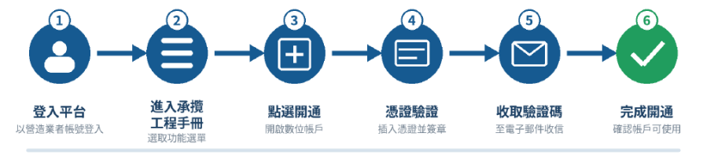
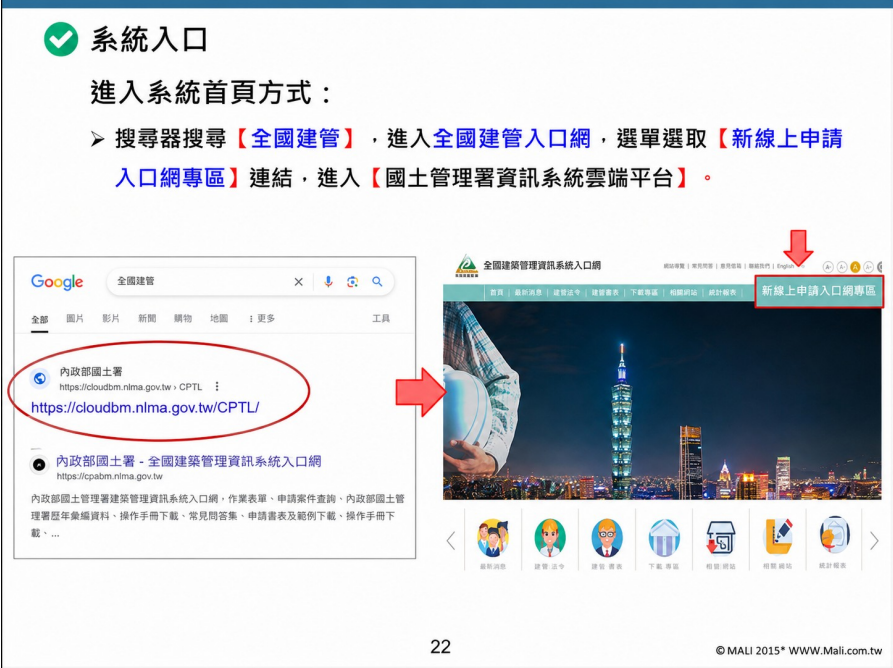
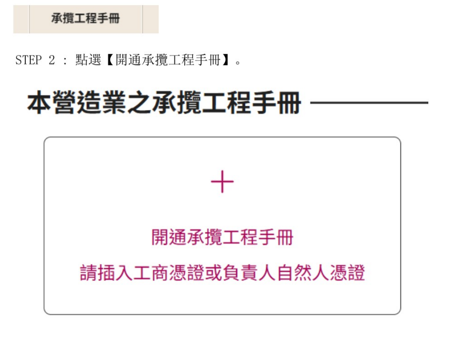
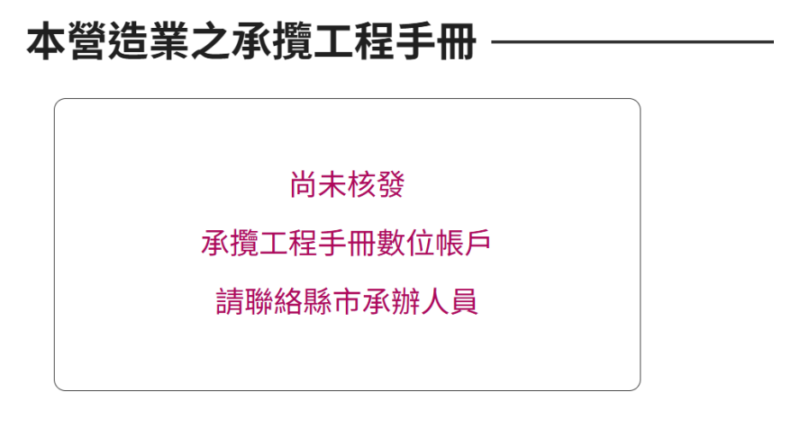
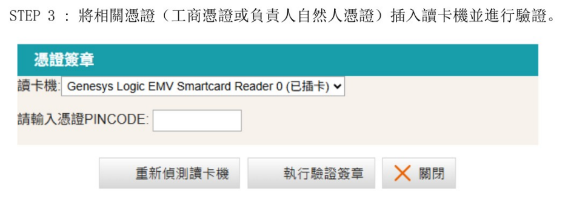
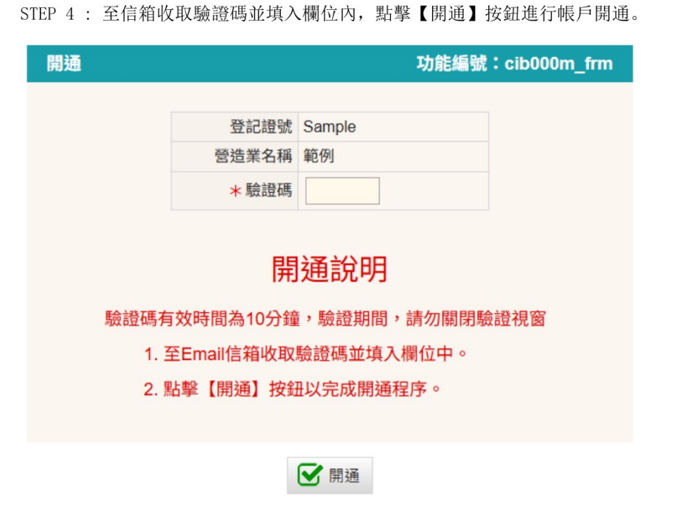

### 系統目的
- 本系統為內政部國土管理署115年8月份起推動上線，預計於116年1月1日正式上線，內政部國土署115年8月份起陸續於全國各縣市政府推動旨揭系統上線輔導講習，請各位民眾密切關注各縣市政府公告之訊息，輔以未來完成營造業登記無紙化，並減少公文及手冊註記現場送件來往時間。
- 本文件說明營造業者如何進入國土管理署資訊系統雲端平台,並完成承攬工程手冊數位帳戶開通。內容包含開通前準備、實際操作步驟、特殊畫面處理方式及常見問題。

!!! 備註
    - 本文件之操作流程以營造業者實際開通畫面為準。教育訓練資料僅作為系統入口、角色設定及一般操作背景參考。
    - 本頁面操作說明資料來源為內政部國土管理署系統建置廠商瑪力資訊股份有限公司所有，有關原始檔案請參閱[(連結)](https://drive.google.com/file/d/15pAfAUyU9Ag6pZLCbEWPTthuRNSlxClZ/view)。

### 適用對象

- 已取得營造業登記，並需要使用承攬工程手冊數位帳戶之營造業者。
- 已完成國土管理署資訊系統雲端平台帳號申請，且使用者角色已設定為「營造業」。

!!! 如何調整使用者角色為營造業

    有關設定(或異動)系統角色一節請參閱[如何註冊線上申請系統](register.md/#_3)

### 開通前準備事項

- 帳號準備
    - 可登入資訊系統雲端平台
    - 使用者角色為「營造業」
    - 營造業資料與登記證書一致
- 憑證準備
    - 工商憑證，或負責人自然人憑證
    - 憑證 PIN Code
- 電腦及信箱準備
    - 晶片讀卡機
    - 已安裝憑證跨平台元件(Hicos元件)
    - 可正常收信之電子郵件信箱

### 開通流程總覽
<figure markdown="span">
{.img-fluid tag=117}
<figcaption>開通步驟流程圖 (圖片來源為瑪力資訊)</figcaption>
</figure>

!!! warning
    驗證碼有效時間為 10 分鐘。執行憑證驗證後，請勿關閉驗證視窗，並於期限內完成驗證碼輸入及開通。

### 詳細操作步驟

1. 進入國土管理署資訊系統雲端平台
    - 開啟瀏覽器，於搜尋引擎搜尋「全國建管」。
    - 進入[「全國建築管理資訊系統入口網」](https://cloudbm.nlma.gov.tw/CPTL/)，或直接於網址列輸入https://cloudbm.nlma.gov.tw/CPTL/。
    - 點選【新線上申請入口網專區】，進入【國土管理署資訊系統雲端平台】。
    - 以已設定為營造業角色的帳號登入。
    <figure markdown="span">
    {.img-fluid tag=118}
    <figcaption>由搜尋結果進入全國建築管理資訊系統入口網，並點選新線上申請入口網專區 (圖片來源為瑪力資訊)</figcaption>
    </figure>

2. 進入承攬工程手冊並選擇開通
    - 登入系統後，於主選單點選【承攬工程手冊】。
    - 在「本營造業之承攬工程手冊」畫面點選【開通承攬工程手冊】。
    - 依畫面提示插入工商憑證或負責人自然人憑證。
    <figure markdown="span">
    {.img-fluid tag=119}
    <figcaption>承攬工程手冊開通入口 (圖片來源為瑪力資訊)</figcaption>
    </figure>
    !!! warning
        - 本功能現在尚未開放設定(115/8/7)，預計於115年8月中旬開放，並請密切關切各縣市政府「承攬工程手冊數位帳戶開通」講習時間。
        - 使用者角色為「營造業」才可看見此畫面。

    #### 特殊狀況：尚未核發數位帳戶

    <figure markdown="span">
    {.img-fluid tag=120}
    <figcaption>未核發承攬工程手冊數位帳戶提示頁面 (圖片來源為瑪力資訊)</figcaption>
    </figure>

    !!! 處理方式

        若畫面顯示「尚未核發承攬工程手冊數位帳戶，請聯絡縣市承辦人員」，表示該營造業目前尚未由主管機關核發數位帳戶，無法自行完成開通。請洽營造業登記所在地之直轄市或縣（市）政府營造業管理單位確認帳戶核發狀態，完成處理後再重新登入辦理開通。

### 執行憑證驗證
- 將工商憑證或負責人自然人憑證插入讀卡機。
- 確認系統已正確偵測讀卡機。
- 輸入憑證 PIN Code。
- 點選【執行驗證簽章】。

    <figure markdown="span">
    {.img-fluid tag=121}
    <figcaption>憑證簽章驗證介面 (圖片來源為瑪力資訊)</figcaption>
    </figure>
    !!! warning
        應使用該營造業之工商憑證，或營造業登記負責人之自然人憑證。若憑證資料與營造業資料不符，系統可能無法完成驗證。

### 輸入驗證碼並完成開通
- 至帳號登記的電子郵件信箱收取驗證碼。
- 將驗證碼輸入系統畫面。
- 於驗證碼有效時間內點選【開通】。
- 系統顯示開通完成後，重新進入【承攬工程手冊】確認帳戶狀態。
    <figure markdown="span">
    {.img-fluid tag=122}
    <figcaption>驗證碼輸入及開通畫面 (圖片來源為瑪力資訊)</figcaption>
    </figure>

### 開通成功確認方式
- 系統顯示開通成功訊息。
- 重新進入【承攬工程手冊】後，可檢視營造業之承攬工程手冊資料。
- 確認營造業名稱、登記證號及帳戶狀態正確。
- 若系統顯示已完成開通但仍無法使用，請保留畫面截圖，並向系統客服反映。

  (02)2748-5205

### 常見問題及排除方式
| 問題或畫面      | 可能原因                          |建議處理方式|
| :---------: | :----------------------------------: | :---------------------------------: |
|找不到【承攬工程手冊】功能|登入角色不正確，或帳號尚未取得營造業角色權限|確認使用者角色為「營造業」；若仍未顯示，洽系統客服確認角色及權限。|
|顯示「尚未核發承攬工程手冊數位帳戶」|主管機關尚未核發數位帳戶|洽營造業登記所在地之直轄市或縣（市）政府營造業管理單位。|
|系統偵測不到讀卡機|讀卡機未連接、驅動程式或憑證跨平台元件異常|重新插拔讀卡機，確認驅動程式及憑證元件已安裝，再點選重新偵測，並須同意簽章的頁面允許彈出式視窗，才可正常進行簽章流程。|
|憑證 PIN Code 錯誤或憑證被鎖定|密碼輸入錯誤次數過多|確認正確 PIN Code；若已鎖卡，依憑證發卡機關程序辦理解鎖。|
|憑證資料與營造業資料不符|使用了非該營造業工商憑證，或非登記負責人自然人憑證|改用正確的工商憑證或負責人自然人憑證。|
|未收到驗證碼|郵件延遲、信箱資料錯誤或郵件誤入垃圾信件匣|檢查垃圾信件匣及帳號登記信箱；逾時後重新執行憑證驗證。|
|驗證碼無效或逾期|超過 10 分鐘，或輸入舊驗證碼|重新執行憑證驗證，並使用最新收到的驗證碼。|
|關閉驗證視窗後無法開通|驗證程序已中斷|重新由憑證驗證步驟開始操作。|
|帳號超過 90 天未登入而停用|系統依資訊安全規定停用帳號|依系統畫面提出審核申請，再洽系統操作問題反映窗口協助。|

### 問題聯繫原則

| 問題類型      | 聯繫單位                          |
| :---------: | :----------------------------------: |
|尚未核發數位帳戶、營造業基本資料或主管機關登記資料異常|營造業登記所在地之直轄市或縣（市）政府營造業管理單位|
|無法登入、找不到功能、角色權限、網頁或驗證碼寄送異常|全國建築管理資訊系統操作問題反映窗口|
|工商憑證或自然人憑證無法使用、PIN Code 鎖定、憑證到期|憑證發卡機關客服|

### 資訊安全及操作注意事項
- 工商憑證、自然人憑證、PIN Code 及電子郵件驗證碼不得提供未授權人員使用。
- 使用共用電腦完成操作後，應登出系統並關閉瀏覽器。
- 若操作畫面包含營造業或個人資料，對外提供截圖前應適當遮蔽敏感資訊。
- 系統畫面或作業規則如有調整，以實際系統顯示及主管機關最新公告為準。

