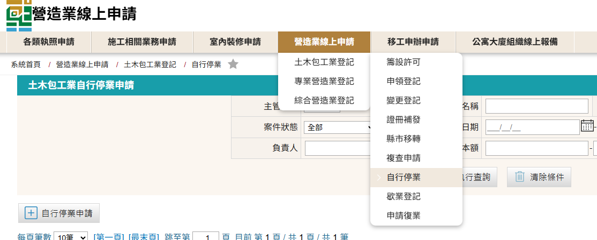
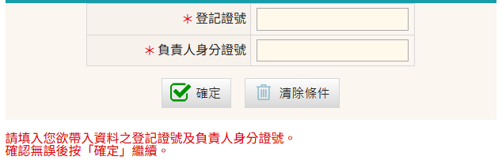
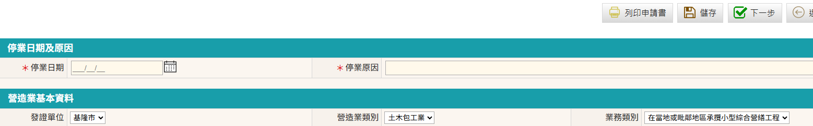
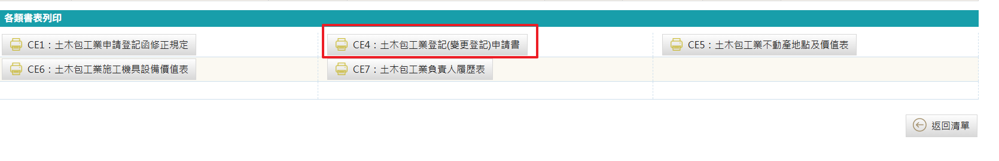
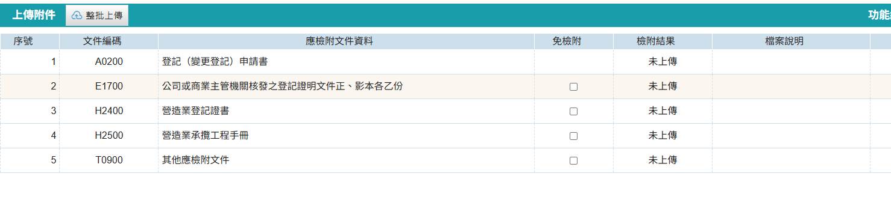
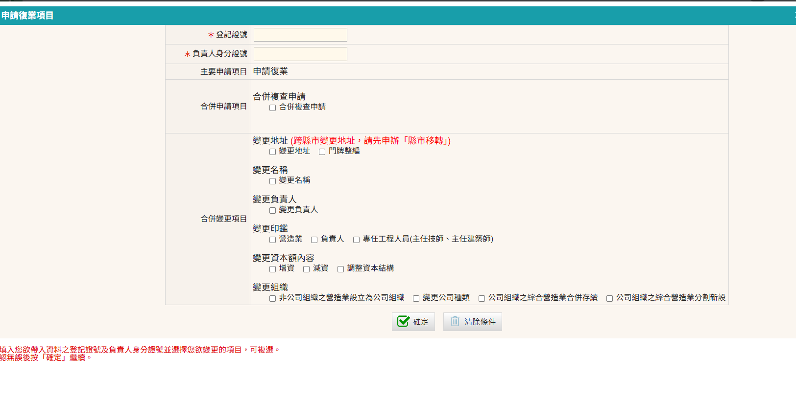
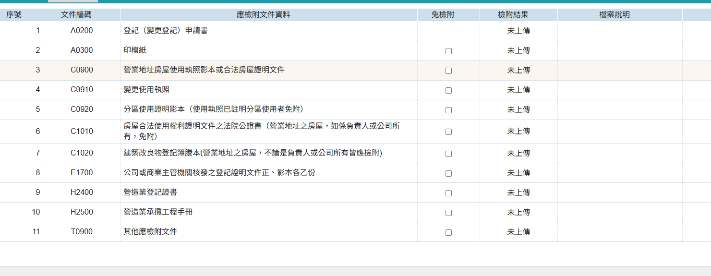

### 變更營業狀態申請相關規定
營造業法第20條規定： 
&emsp;&emsp;1、營造業 ==自行停業== 或受停業處分時，應將其營造業登記證書及承攬工程手冊送繳中央主管機關或直轄市、縣（市）主管機關註記後發還之；==復業時，亦同。== 
&emsp;&emsp;2、營造業 ==歇業== 時，應將其營造業登記證書及承攬工程手冊，送繳中央主管機關或直轄市、縣（市）主管機關，並辦理廢止登記。 

### 停業、歇業申請步驟
1. 進入「營造業線上申請」→「土木包工業登記」→「自行停業」進行申請(如辦理歇業者請選擇「歇業登記」)
    <figure markdown="span">
    {.img-fluid tag=47}
    <figcaption>依圖片進入申請系統</figcaption>
    </figure>
2. 點選「自行停業申請」按鈕進行申請，輸入登記證號[(格式參考)](change_capital.md)以及負責人身分證(辦理歇業登記操作畫面亦同)
    <figure markdown="span">
    {.img-fluid tag=48}
    <figcaption>自行停業級歇業申請不得與其他變更案併辦</figcaption>
    </figure>
3. 輸入工商主管機關申報核備之停業日期(或歇業日期)，並略述其原因
    <figure markdown="span">
    {.img-fluid tag=49}
    <figcaption>輸入後儲存後進入書表列印</figcaption>
    </figure>
4. 列印系統產出之變更登記申請書，由負責人簽名並用印後後續掃描上傳
    <figure markdown="span">
    {.img-fluid tag=50}
    <figcaption>需使用系統產出之書表用印</figcaption>
    </figure>
5. 停業申請需上傳文件列表(辦理歇業登記需上傳文件亦同)
    - 如辦理停業或歇業時登記證書或承攬手冊遺失者，須登報掛失，其登載報紙請掃描上傳至其他應檢附文件
    <figure markdown="span">
    {.img-fluid tag=51}
    <figcaption>依文件上傳列表上傳文件</figcaption>
    </figure>
6. 依照營造業法第20條規定，辦理停業時須將承攬手冊正本及登記證書正本送至主管機關註記後發還之。 
    - 辦理歇業時須將承攬手冊正本及登記證書正本送繳至主管機關，並辦理廢止登記。(不發還)
    
    !!! note

        依內政部營建署106年3月9日營署中建字第1063501411號函釋規定，營造業於停業期間，公司負責人之法定效力如仍存在 ，依上開規定(營造業法第28條)應不得為其他營造業之負責人、專任工程人員或工地主任 。

### 復業申請步驟
1. 進入「營造業線上申請」→「土木包工業登記」→「申請復業」進行申請，輸入登記證號[(格式參考)](change_capital.md)以及負責人身分證
    <figure markdown="span">
    {.img-fluid tag=52}
    <figcaption>申請復業可合併複查申請或其他變更案一同辦理</figcaption>
    </figure>
2. 復業申請與前項申請項目相同，列印系統產出之變更登記申請書，由負責人簽名並用印後後續掃描上傳，並且依文件列表上傳商業主管機關核備之復業函文及其他相關文件。
    - 如辦理復業申請時登記證書或承攬手冊遺失者，須於復業申請核准後，另行辦理[證冊補發](receive_manual_2.md)。
    <figure markdown="span">
    {.img-fluid tag=53}
    <figcaption>依文件上傳列表上傳文件</figcaption>
    </figure>

    !!! note

        如單純申請復業，無遷移地址，或變更負責人等相關情事者，可免檢附營業地址相關變更文件(文件列表3~7)

