### 土木包工業籌設許可

依營造業法第三條第五點相關規定，主管機關為直轄市、縣（市）政府，土木包工業設立分兩階段，第一階段需先向縣（市）政府進行「籌設許可」申請，進行設立之資格審查，於資格審查通過後，由審查機關發文通知，俟取得核准設立函文至工商或公司主管機關進行營業項目登記，取得公司登記後可再進行第二階段之[「申領登記」](receive_manual.md)申請。

!!! 營造業法第三條第五點規定

    五、土木包工業：係指經向直轄市、縣（市）主管機關辦理許可、登記，在當地或毗鄰地區承攬小型綜合營繕工程之廠商。

### 籌設許可申請步驟

1. 進入「新建築執照線上申請書電子化書圖文件送件繳交系統」
    <figure markdown="span">
    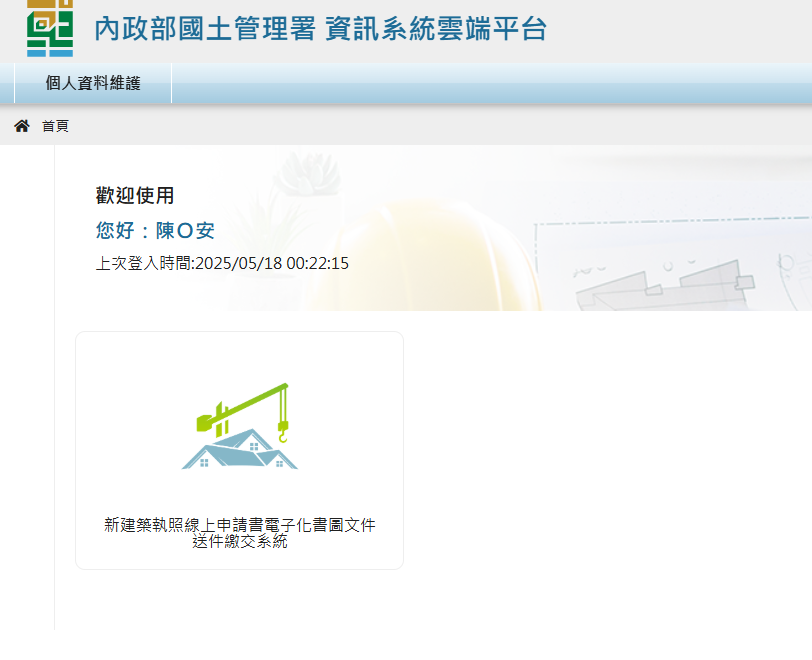{.img-fluid tag=8}
    <figcaption>點選「書圖文件送件繳交系統」</figcaption>
    </figure>

2. 進入「營造業線上申請」→「土木包工業登記」→「籌設許可」進入進行申請
    <figure markdown="span">
    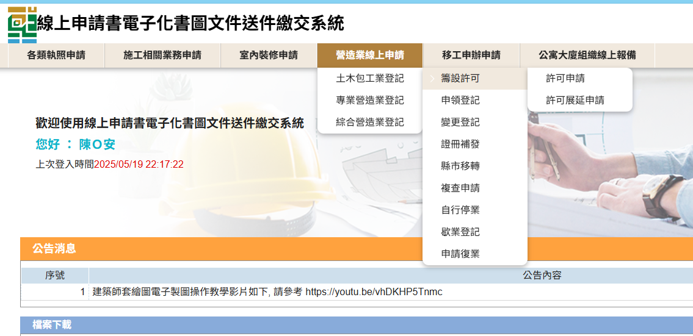{.img-fluid tag=9}
    <figcaption>依圖片進入申請系統</figcaption>
    </figure>

3. 點選「許可申請」按鈕建立案件
    <figure markdown="span">
    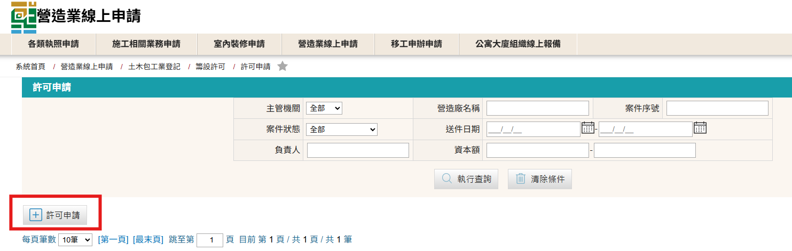{.img-fluid tag=10}
    <figcaption>點選許可申請按鈕建立案件</figcaption>
    </figure>

4. 登打公司基本資料
    <figure markdown="span">
    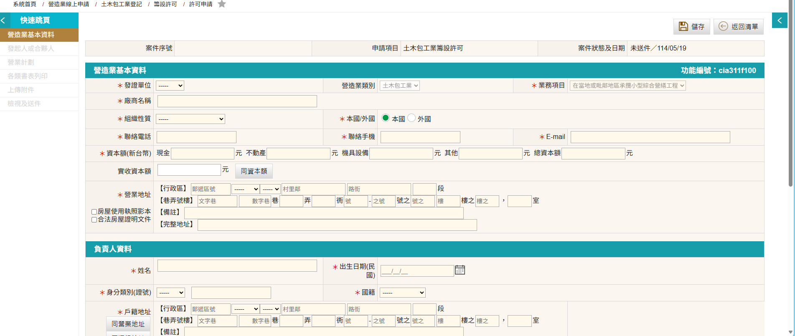{.img-fluid tag=11}
    <figcaption>輸入基本資料</figcaption>
    </figure>

    !!! warning

        有關土木包工業設立基本門檻：  1、資本額需100萬以上 2、負責人不得為其他營造廠之負責人，及須有工程營繕之相關經歷達3年以上 3、登記地址用途須為G-2類辦公室用途（可至縣市政府辦理變更使用用途）

### 上傳負責人相片，公司大小章及簽名
<figure markdown="span">
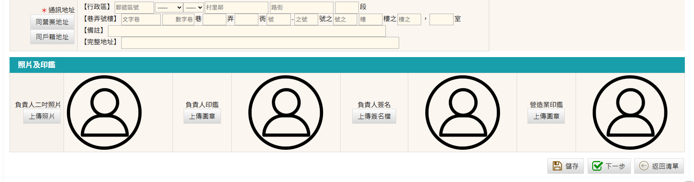{.img-fluid tag=12}
<figcaption>上傳負責人相片，公司大小章及簽名，文件格式僅限JPG檔</figcaption>
</figure>
   
!!! warning

    上傳圖負責人相片，公司大小章及簽名注意事項如下： 
    1、上傳檔案 ==格式僅限JPG檔== ，上傳成功會在畫面上顯示上傳內容，若上傳失敗會影像後續表格內容帶入。 
    2、可將負責人相片，印鑑，簽名掃描成電子檔後後使用 `windows鍵` + `shift鍵` + `S鍵` (MAC系統為 `Command鍵` + `shift鍵` + `4鍵`)進行快速畫面擷取，擷取時請去掉多餘畫面白邊，使文件剛剛好為需求大小。

上傳相片範例
    <figure markdown="span">
    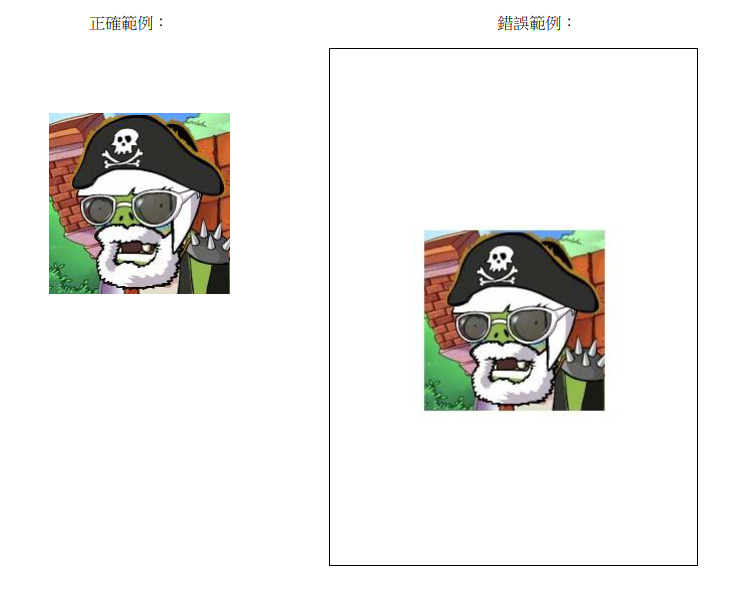{.img-fluid tag=13}
    <figcaption>正確上傳需完整去除相片多於白邊，且不應影響內容</figcaption>
    </figure>

### 土木包工業許可申請書列印
以上營造業基本資料、發起人或合夥人資料、營業計劃完成登打後請至各類書表列印頁面，列印出「CE3：土木包工業許可申請書」，表格內容會將前項登打內容自動帶入表格，不須手動登打， ==請務必使用產出表格簽章用印，以免手動登打誤繕導致與系統資料不一致== 。
    <figure markdown="span">
    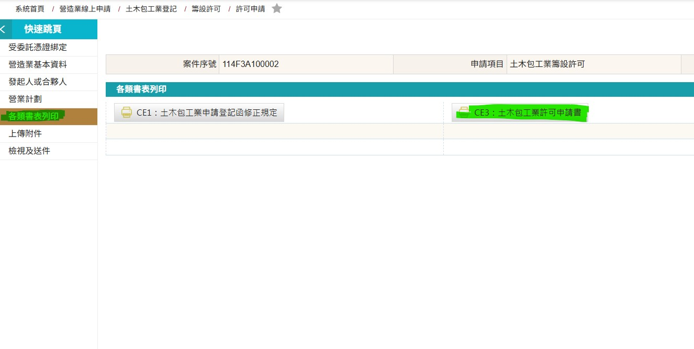{.img-fluid tag=14}
    <figcaption>列印許可申請書簽名用印</figcaption>
    </figure>
表格產製後，須由負責人本人於申請書上用大小印並簽名，以及簽署負責人未擔任其他營造業之負責人、專任工程人員或工地主任切結。
    <figure markdown="span">
    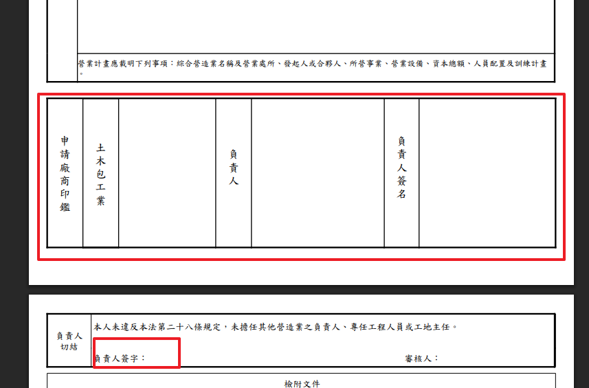{.img-fluid tag=15}
    <figcaption>負責人用公司大小印連同切結並簽名</figcaption>
    </figure>

!!! warning

    有關各縣(市)政府收件規定及標準，需依申請地主管縣(市)政府政府規定為準，部分縣(市)政府要求負責人須到場親簽，部分不用，請逕洽各縣(市)政府承辦人。
### 土木包工業申請附件上傳
土木包工業許可申請需上傳文件如圖：
    <figure markdown="span">
    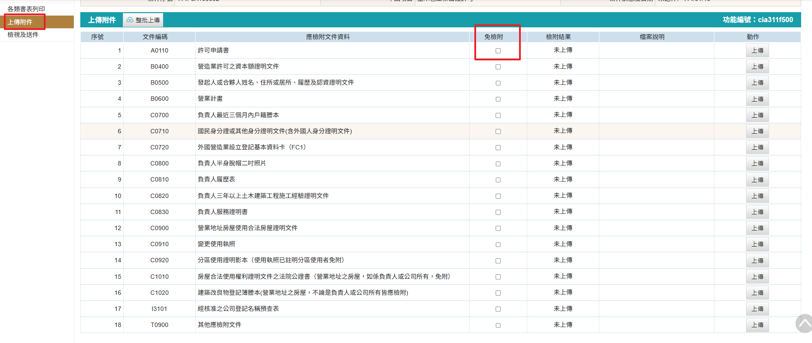{.img-fluid tag=16}
    <figcaption>依列表要求上傳附件(若與公司實際情形不合之文件可勾選「免檢附」)</figcaption>
    </figure>

!!! warning

    文件上傳注意事項： 
    1、文件`C0830 負責人服務證明書`須辦理公證，若服務機關為政府單位則免公證 
    2、文件`C0910 變更使用執照`若登記地址使用執造存根為「辦公室」用途則不需辦理變更，可勾選「免檢附」不須上傳，若非辦公室用途則需洽所屬縣(市)政府使用管理科辦理用途變更。 
    3、`C1010 房屋合法使用權利證明文件之法院公證書`若房屋所有權為負責人所有則不需辦理租約公證，可勾選「免檢附」不須上傳，若所有權人需辦理租約公證。 
    4、`C0720 外國營造業設立登記基本資料卡（FC1）`非本國營造業才須上傳，本國營造業可勾選「免檢附」不須上傳。 
    5、`T0900 其他應檢附文件`視各縣(市)主管機關承辦決定是否上傳其他補充資料。
系統送件時 ==必須== 使用自然人憑證，以下講解憑證綁定步驟。
### 憑證綁定步驟
綁定憑證時請至畫面右上角，點選帳戶名稱→註冊憑證作業 (如下圖)
    <figure markdown="span">
    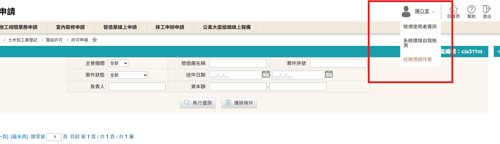{.img-fluid tag=17}
    <figcaption>點選帳戶名稱→註冊憑證作業</figcaption>
    </figure>
點選新增按鈕可加入數張憑證 (帳戶類型為營造廠可輸入工商憑證卡號)，自然人憑證卡號為卡片上條碼下方之英文2位 + 數字14碼之格式，輸入後點擊儲存即可於送件時進行憑證簽章。
    <figure markdown="span">
    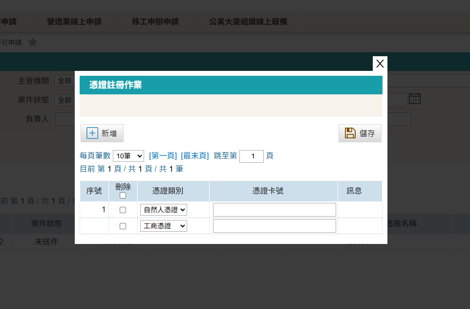{.img-fluid tag=18}
    <figcaption>可新增多張憑證</figcaption>
    </figure>

!!! warning

    綁定之憑證務必和帳號登記人姓名，身分證一致，否則進行憑證簽章時將會無法驗證。
### 土木包工業許可申請送件
上述文件列表文件皆已上傳 ==（包含不須上傳的部分需勾選免檢附）== ，以及第一部分之資料完成登打，無缺漏事項時，系統方可開放送件。 
案件送出時會執行電子簽章程序，若成功將會顯示送件成功，案件可於縣市管理者未收件時進行自行抽回，若承辦以收件，需請縣市承辦協助退件，進行案件修改(退件不會導致案件內容遺失)。

!!! warning

    若送件人為受託人，則會多額外一步驟，需額外簽署委託書；請列印出來請委託人用印，受託人用印後掃描上傳至文件列表，方可進行送件。
