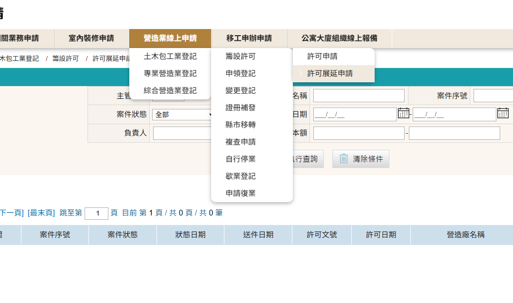
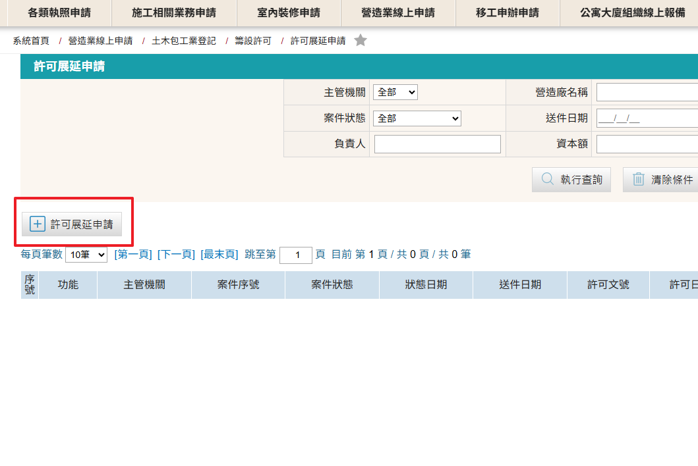
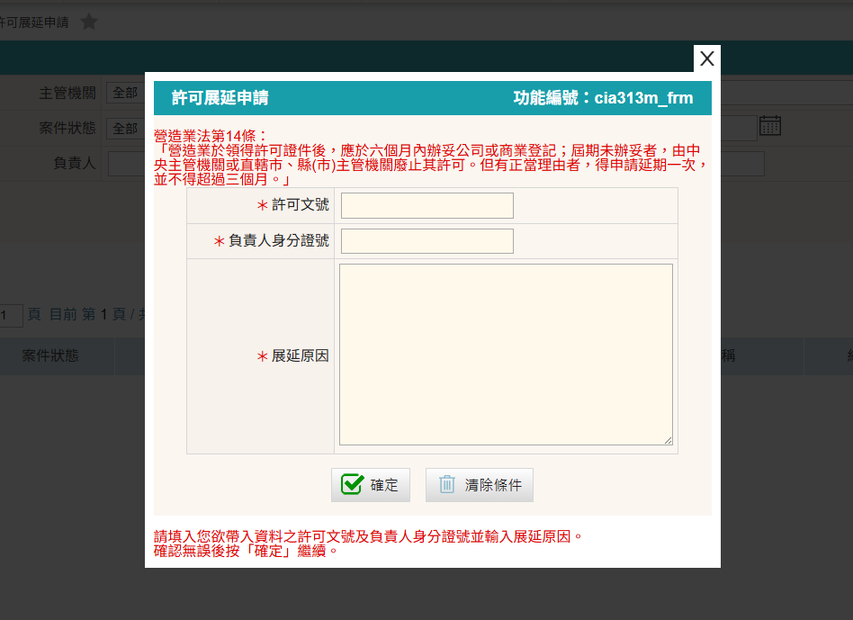

### 許可展延相關規定

營造業法第14條規定： 
&emsp;&emsp;「營造業於領得許可證件後，應於六個月內辦妥公司或商業登記；屆期未辦妥者，由中央主管機關或直轄市、縣(市)主管機關廢止其許可。但有正當理由者，得申請延期一次，並不得超過三個月。」

### 土木包工業許可展延申請步驟

1. 進入「營造業線上申請」→「土木包工業登記」→「籌設許可」→「許可展延申請」進行申請
    <figure markdown="span">
    {.img-fluid tag=19}
    <figcaption>有關綜合營造業許可展延請至「綜合營造業登記」列表項下進行「許可展延申請」</figcaption>
    </figure>

2. 點選「許可展延申請」按鈕進行案件展延
    <figure markdown="span">
    {.img-fluid tag=20}
    <figcaption>點選「許可展延申請」按鈕進行案件展延</figcaption>
    </figure>

3. 原案件許可文號須至原[許可申請](Contractors_Registration.md)頁面取得
    <figure markdown="span">
    {.img-fluid tag=20_1}
    <figcaption>原案件核准後可取得許可文號及日期</figcaption>
    </figure>
4. 輸入原案件許可文號、負責人身分證及需展延原因，並按確定送出。
    <figure markdown="span">
    {.img-fluid tag=21}
    <figcaption>點選「許可展延申請」按鈕進行案件展延</figcaption>
    </figure>

    