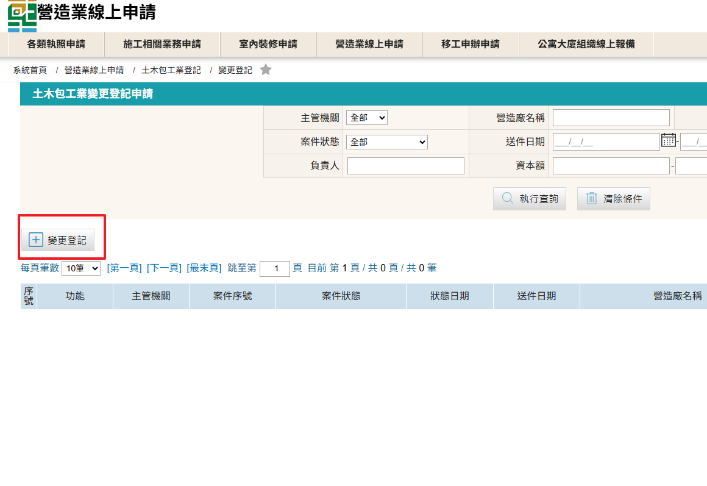
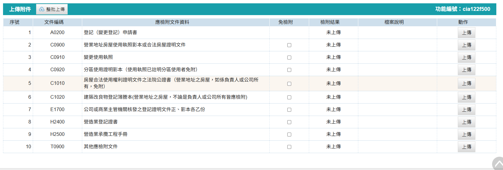

### 變更地址申請步驟

變更地址僅限於「同縣市內地址變更」，若從外縣市移入，或移出至外縣市，請辦理[「縣市移轉」](change_city.md)

1. 進入「營造業線上申請」→「綜合營造業登記」→「變更登記」進行申請
    <figure markdown="span">
    {.img-fluid tag=25}
    <figcaption>依圖片進入申請系統</figcaption>
    </figure>

2. 點選「變更登記」按鈕進行申請
    <figure markdown="span">
    {.img-fluid tag=26}
    <figcaption>點選「變更登記」按鈕進行申請</figcaption>
    </figure>
3. 選取須變更地址選項
    <figure markdown="span">
    {.img-fluid tag=30}
    <figcaption>選取須變更地址選項</figcaption>
    </figure>

4. 文件上傳列表
    * 變更登記申請書需使用系統套印之版本
    * 依實際情況檢附需繳交的文件，不需要上傳的項目請勾選免檢附
    <figure markdown="span">
    {.img-fluid tag=31}
    <figcaption>依要求上傳相關文件(僅限PDF檔)</figcaption>
    </figure>

### 變更地址申請送件
憑證綁定步驟與[許可申請](Contractors_Registration.md)送件流程相同，送件人皆需以自然人憑證進行簽章送件，若送件人為受託人，需額外簽署委託書；請列印出來請委託人用印，受託人用印後掃描上傳至文件列表，方可進行送件。 
 
線上案件送件成功後，須將手冊及證書送至縣市政府，後續進行手冊註記及證書換發。    