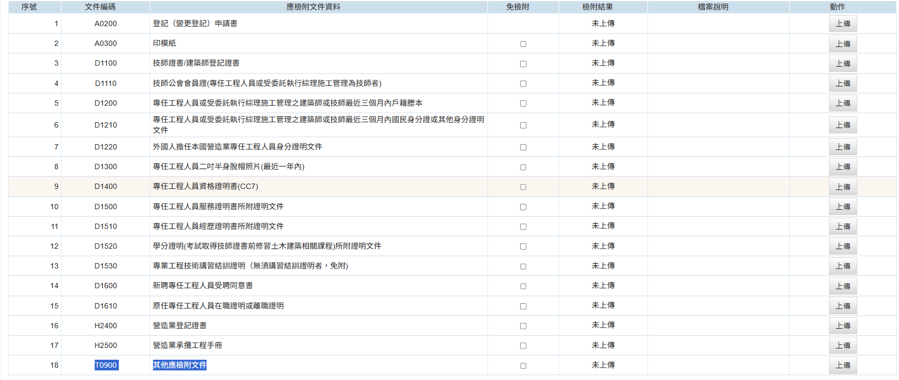

  <meta name="robots" content="noindex" />

### 專任工程人員相關規定
營造業法第40條規定： 
&emsp;&emsp;1、營造業之專任工程人員離職或因故不能執行業務時，營造業應即報請中央主管機關備查，並應於三個月內依規定另聘之。 
&emsp;&emsp;2、前項期間如有繼續施工工程，其專任工程人員之工作，應委由符合營造業原登記等級、類別且未設立事務所或未受聘於技術顧問機構或營造業之建築師或技師擔任。 
&emsp;&emsp;3、前項之技師，應於加入公會後，始得為之。 
營造業法第66條第4項規定： 
&emsp;&emsp;4、本法施行前原依營造業管理規則規定聘工地主任擔任專任工程人員之丙等營造業於換領為丙等綜合營造業五年後，得採置專任工程人員或委託建築師或技師逐案按各類科技師之執業範圍核實執行綜理施工管理，並簽章負責專任工程人員應辦理之工作。該 ==建築師或技師== 註1不得設立事務所或受聘於技術顧問機構，且技師應加入公會後，始得為之。並應於每次受理委託簽章後，逐案向工程所在地之直轄市或縣（市）主管機關報備登錄。

!!! 註1營造業法第66條第4項說明

    本聘任方式為採「逐案簽證」方式，營造廠可委託其他營造廠登記之技師，以逐案方式至工程所在地縣市機關進行綜理施工管理報備。 
    * 逐案簽證報備方式目前仍須以紙本方式至工程所在地縣市機關進行報備

### 綜合營造業專任工程變更申請步驟
1. 進入「營造業線上申請」→「綜合營造業登記」→「變更登記」進行申請
    <figure markdown="span">
    {.img-fluid tag=65}
    <figcaption>依圖片進入申請系統</figcaption>
    </figure>
2. 選擇「專任工程人員異動報備」
    <figure markdown="span">
    {.img-fluid tag=66}
    <figcaption>依圖片進入申請系統</figcaption>
    </figure>
!!! 項目說明

    變更專任工程人員：包括專任工程人員離職，新聘專任工程人員，增聘專任工程人員，或新聘離職同時辦理 
    專任工程人員離職或因故不能執行業務報請備查：專任工程人員於請假日前 15 日內報請主管機關備查，專任工程人員短期請假及代理以每年度至多 30 日為限，可分次申請。

#### 新聘專任工程人員步驟
1. 於營造業基本資料輸入完整，上傳負責人照片及簽名後至「專任工程人員資料頁面」進行資料異動
    <figure markdown="span">
    {.img-fluid tag=67}
    <figcaption>新聘專任工程人員點選紅框新增按鈕新增新專任工程人員</figcaption>
    </figure>
2. 畫面操作與綜合營造業[籌設許可申請](Contractors_Registration.md)新增專任工程人員基本資料步驟一樣，本章不再重複贅述
    <figure markdown="span">
    {.img-fluid tag=68}
    <figcaption>新增新專任工程人員介面</figcaption>
    </figure>

#### 舊任專任工程人員離職步驟
1. 若營造業原登記專任工程人員需離職請於原登記之專任工程人員資料進行編輯
    <figure markdown="span">
    {.img-fluid tag=69}
    <figcaption>由紅框處進入原登記專任工程人員資料編輯</figcaption>
    </figure>
2. 將原登記專任工程人員狀態調整為「離職」，並輸入「離職日期」
    <figure markdown="span">
    {.img-fluid tag=70}
    <figcaption>請調整紅框位置資料，並上傳原登記技師之照片及簽名</figcaption>
    </figure>

#### 新聘專任工程人員併同舊任專任工程人員離職
- 將上述「新聘專任工程人員步驟」及「舊任專任工程人員離職步驟」一節按照步驟執行一遍即完成技師同步辦理更換。

!!! warning

    為避免現有工程技師簽證問題，新聘新技師併同舊任專任工程人員離職辦理時最好要原技師離職隔天隨即安排新技師到職，達到無縫接軌之更換，以免工程簽證出現異常。 
    如：原技師114年6月16日登記離職，新聘技師於114年6月17日登記到職。

#### 專任工程人員因故不能執行業務報備
1. 點選需請假之專任工程人員資料進行編輯
    <figure markdown="span">
    {.img-fluid tag=69-1}
    <figcaption>由紅框處進入原登記專任工程人員資料編輯</figcaption>
    </figure>

2. 將原登記專任工程人員狀態調整為「請假及代理」，並輸入「請假日期」
    <figure markdown="span">
    {.img-fluid tag=71}
    <figcaption>請調整紅框位置資料，並上傳原登記技師之照片及簽名</figcaption>
    </figure>
3. 同頁面捲動至下方，輸入代理人資料(若代理專任工程人員無受聘至任何營造廠，受聘營造廠欄位可填無，代理專任工程人員仍需兩年以上之工程經歷)
    <figure markdown="span">
    {.img-fluid tag=72}
    <figcaption>填寫代理人之資料</figcaption>
    </figure>

#### 文件上傳列表說明
- 請依列表準備文件，惟 專任工程人員因故不能執行業務報備需填寫[營造業專任工程人員（主任技師或主任建築師）因故擬短期請假及代理申請表](https://www.ud.taichung.gov.tw/media/299978/56515214532.pdf)(點選連結下載表格)，由請假人之營造廠及代理人之營造廠雙方簽名用印後，上傳至T0900 其他應檢附文件欄位中。
    <figure markdown="span">
    {.img-fluid tag=73}
    <figcaption>專任工程人員因故不能執行業務報備需額外上傳「營造業專任工程人員（主任技師或主任建築師）因故擬短期請假及代理申請表」</figcaption>
    </figure>

#### 申請送件
憑證綁定步驟與[許可申請](Contractors_Registration.md)送件流程相同，送件人皆需以自然人憑證進行簽章送件，若送件人為受託人，需額外簽署委託書；請列印出來請委託人用印，受託人用印後掃描上傳至文件列表，方可進行送件。 
 
線上案件送件成功後，須將手冊及營造業登記證書、新舊技師證書，新技師[印模紙](https://www.treca.org.tw/treca-journal/2015-07-31-07-57-30.html)(專任工程人員因故不能執行業務報備不須送新舊技師證書，新技師印模紙)送至縣市政府，後續進行手冊註記及技師證書註記。    