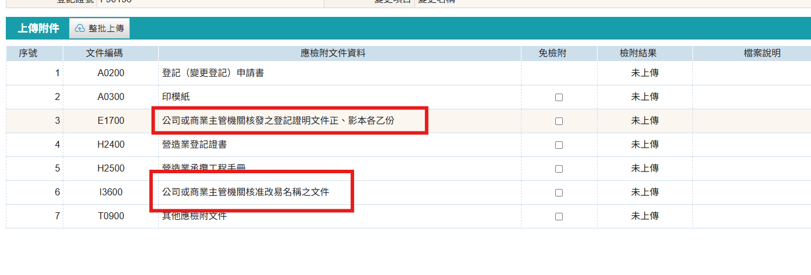

### 變更公司名稱申請步驟

1. 進入「營造業線上申請」→「綜合營造業登記」→「變更登記」進行申請
    <figure markdown="span">
    {.img-fluid tag=25}
    <figcaption>依圖片進入申請系統</figcaption>
    </figure>

2. 點選「變更登記」按鈕，選擇變更名稱進行申請
3. 變更名稱申請上傳項目
    <figure markdown="span">
    {.img-fluid tag=35}
    <figcaption>「變更名稱」需上傳資料 (需檢附商業主管機關之變更名稱核准函文，及公司或商業主管機關核准改易名稱之文件)</figcaption>
    </figure>

### 變更公司名稱申請送件
本申請於送件後，需攜帶原登記證書及承攬手冊至登記地所屬縣市政府進行送件。  
憑證綁定步驟與[許可申請](Contractors_Registration.md)送件流程相同，送件人皆需以自然人憑證進行簽章送件，若送件人為受託人，需額外簽署委託書；請列印出來請委託人用印，受託人用印後掃描上傳至文件列表，方可進行送件。 
 
線上案件送件成功後，須將手冊本冊(正本)及原登記證書送至縣市政府，後續進行手冊註記。    