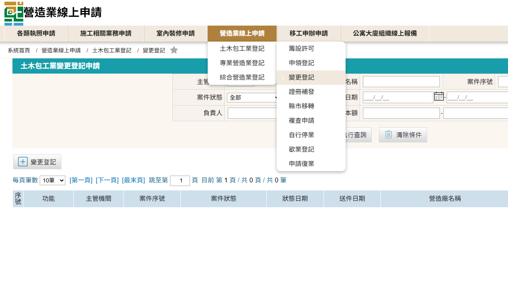
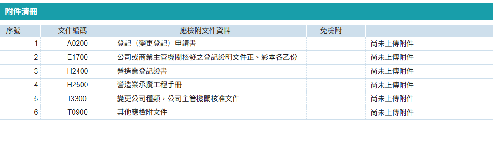

變更組織類型僅指變更公司類型，如：獨資轉換為有限公司等，不包含由土木包工業變更為綜合營造業，如需變更為綜合營造業，須辦理土木包工業歇業後，另行辦理設立綜合營造業籌設許可。 

### 變更公司組織類型申請步驟

1. 進入「營造業線上申請」→「綜合營造工業登記」→「變更登記」進行申請
    <figure markdown="span">
    {.img-fluid tag=25}
    <figcaption>依圖片進入申請系統</figcaption>
    </figure>

2. 有關進行「變更組織」時，因組織變更涉及名稱變更，如：「丁丁有限公司」因組織變更，故名稱變更為「丁丁股份有限公司」，請於選擇變更項目時請同時勾選「名稱變更」，才可於案件變更時同步更改公司名稱，又或公司進行合併或分割後涉及名稱變更者也需勾選「名稱變更」選項。
    <figure markdown="span">
    {.img-fluid tag=107}
    <figcaption>「變更組織」需併同勾選其餘需變更相關項目</figcaption>
    </figure>
3. 變更名稱申請上傳項目
    <figure markdown="span">
    {.img-fluid tag=36}
    <figcaption>「變更組織」需上傳資料 (需檢附商業主管機關之變更組織核准函文)</figcaption>
    </figure>

!!! warning

    有關「公司組織之綜合營造業合併存續」或是「公司組織之綜合營造業分割新設」均於工商主管機關核准變更後至所屬縣市政府辦理，前項合併存續變更須於營造廠合併後至「合併消滅」營造廠所在地縣市政府辦理歇業事宜；後項分割新設須至分割後新成立登記地之縣市政府辦理籌設事宜。

### 變更公司組織類型申請送件
本申請於送件後，需攜帶原登記證書及承攬手冊至登記地所屬縣市政府進行送件(如涉及營造業分割或消滅情事者，須於本次變更業務辦妥後至登記地所屬縣市政府辦理第二間營造廠變更登記相關事宜)。  
憑證綁定步驟與[許可申請](Contractors_Registration.md)送件流程相同，送件人皆需以自然人憑證進行簽章送件，若送件人為受託人，需額外簽署委託書；請列印出來請委託人用印，受託人用印後掃描上傳至文件列表，方可進行送件。 
 
線上案件送件成功後，須將手冊本冊(正本)及原登記證書送至縣市政府，後續進行手冊註記。    