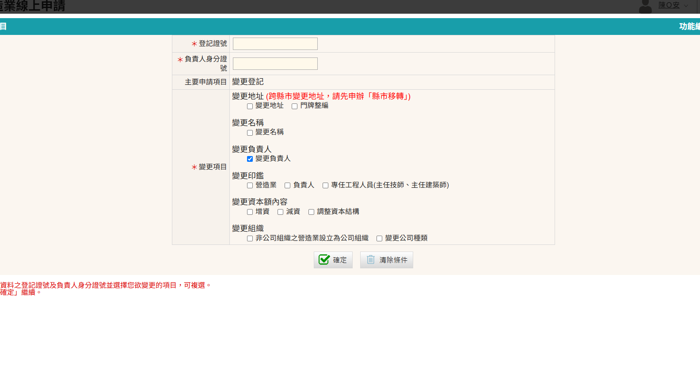
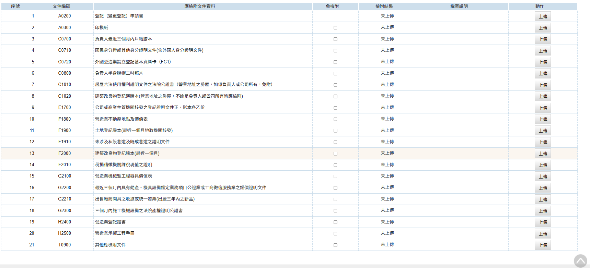

### 變更負責人申請步驟

1. 進入「營造業線上申請」→「綜合營造業登記」→「變更登記」進行申請
    <figure markdown="span">
    {.img-fluid tag=25}
    <figcaption>依圖片進入申請系統</figcaption>
    </figure>

2. 點選「變更登記」按鈕進行申請
    <figure markdown="span">
    {.img-fluid tag=32}
    <figcaption>點選「變更負責人」按鈕進行申請</figcaption>
    </figure>

3. 變更負責人申請上傳項目
    <figure markdown="span">
    {.img-fluid tag=78}
    <figcaption>「變更負責人」需上傳資料</figcaption>
    </figure>

    !!!note
        依據內政部113年1月19日發布之[法規命令](https://www.moi.gov.tw/News_Content.aspx?n=145&s=312758)，放寬辦理負責人及印鑑申請變更時，不須原負責人具名申請及加蓋原負責人印鑑之規定，以達簡政便民並有利營造業辦理上開變更項目之申請。

### 變更負責人申請送件
本申請於送件後，需攜帶貼有負責人兩吋照片、簽名、公司大小印之[印模紙(點選連結下載範本)](https://www.treca.org.tw/treca-journal/2015-07-31-07-57-30.html)，以及原登記證書至登記地所屬縣市政府進行送件。  
憑證綁定步驟與[許可申請](Contractors_Registration.md)送件流程相同，送件人皆需以自然人憑證進行簽章送件，若送件人為受託人，需額外簽署委託書；請列印出來請委託人用印，受託人用印後掃描上傳至文件列表，方可進行送件。 
 
線上案件送件成功後，須將手冊及證書、印模紙送至縣市政府，後續進行手冊註記及證書換發。    
