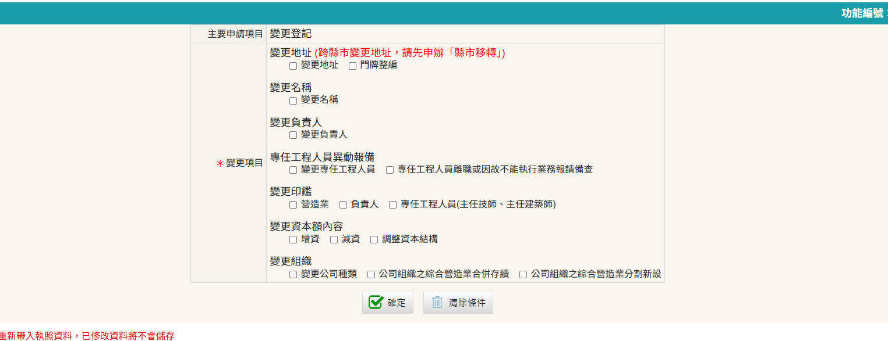
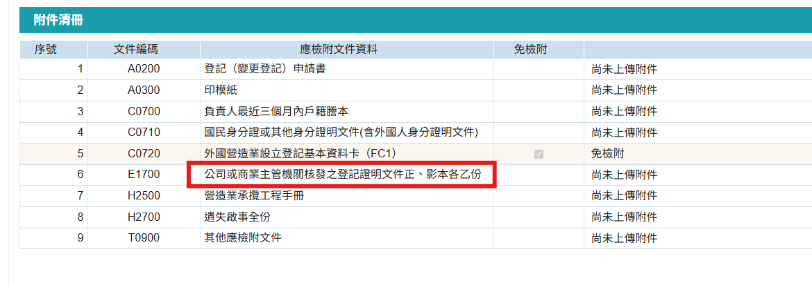
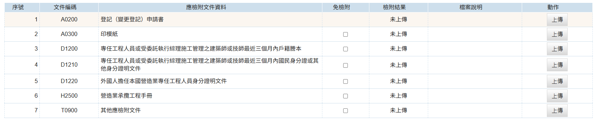

本申請為辦理未變更負責人或專任工程人員，而需變更公司印鑑或負責人、專任工程人員印鑑，如需變更負責人或專任工程人員則不需額外辦理變更印鑑。 

### 變更印鑑申請步驟

1. 進入「營造業線上申請」→「綜合營造業登記」→「變更登記」進行申請
    <figure markdown="span">
    {.img-fluid tag=25}
    <figcaption>依圖片進入申請系統</figcaption>
    </figure>

2. 點選「變更登記」按鈕，選擇需變更印鑑種類進行申請
    <figure markdown="span">
    {.img-fluid tag=79}
    <figcaption>選擇須辦理變更公司印鑑，或負責人印鑑，或專任工程人員印鑑</figcaption>
    </figure>
3. 變更印鑑申請上傳項目
    <figure markdown="span">
    {.img-fluid tag=34}
    <figcaption>變更「公司」印鑑需上傳資料 (需檢附商業主管機關之變更印鑑核准函文)</figcaption>
    </figure>
    <figure markdown="span">
    {.img-fluid tag=80}
    <figcaption>變更「負責人或專任工程人員」印鑑需上傳資料 (需檢附該員國民身分證或戶籍謄本)</figcaption>
    </figure>

### 變更印鑑申請送件
本申請於送件後，需攜帶貼有負責人兩吋照片(或專任工程人員)、簽名、新變更之印鑑[印模紙(點選連結下載範本)](https://www.treca.org.tw/treca-journal/2015-07-31-07-57-30.html)至登記地所屬縣市政府進行送件。  
憑證綁定步驟與[許可申請](Contractors_Registration.md)送件流程相同，送件人皆需以自然人憑證進行簽章送件，若送件人為受託人，需額外簽署委託書；請列印出來請委託人用印，受託人用印後掃描上傳至文件列表，方可進行送件。 
 
線上案件送件成功後，須將手冊及印模紙送至縣市政府，後續進行手冊註記。    