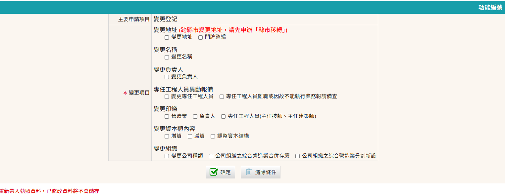
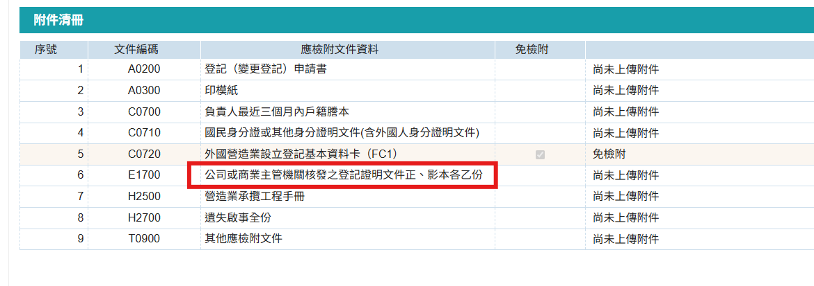
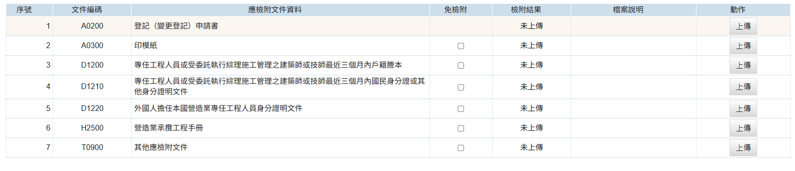

本申請為辦理未變更負責人、專任工程人員及公司名稱，而需變更公司印鑑或負責人及專任工程人員印鑑之申請，如需變更負責人、專任工程人員或公司名稱則不需額外辦理變更印鑑。 

!!! warning

    若於營造業登記停業期間，經濟部登記事項有變更時，則於營造業復業時併同辦理變更即可。

### 變更印鑑申請步驟

1. 進入「營造業線上申請」→「綜合營造業登記」→「變更登記」進行申請
    <figure markdown="span">
    {.img-fluid tag=25}
    <figcaption>依圖片進入申請系統</figcaption>
    </figure>

2. 點選「變更登記」按鈕，選擇需變更印鑑種類進行申請
    <figure markdown="span">
    {.img-fluid tag=79}
    <figcaption>選擇須辦理變更公司印鑑，或負責人印鑑，或專任工程人員印鑑</figcaption>
    </figure>
3. 變更印鑑申請上傳項目
    <figure markdown="span">
    {.img-fluid tag=34}
    <figcaption>變更「公司」印鑑需上傳資料 (需檢附商業主管機關之變更印鑑核准函文)</figcaption>
    </figure>
    <figure markdown="span">
    {.img-fluid tag=80}
    <figcaption>變更「負責人或專任工程人員」印鑑需上傳資料 (需檢附該員國民身分證或戶籍謄本)</figcaption>
    </figure>

### 變更印鑑申請送件
本申請於送件後，需攜帶貼有負責人兩吋照片(或專任工程人員)、簽名、新變更之印鑑[印模紙(點選連結下載範本)](https://www.treca.org.tw/treca-journal/2015-07-31-07-57-30.html)至登記地所屬縣市政府進行送件。  
憑證綁定步驟與[許可申請](Contractors_Registration.md)送件流程相同，送件人皆需以自然人憑證進行簽章送件，若送件人為受託人，需額外簽署委託書；請列印出來請委託人用印，受託人用印後掃描上傳至文件列表，方可進行送件。 
 
線上案件送件成功後，須將手冊及印模紙送至縣市政府，後續進行手冊註記。 

### 申請綜合營造業印鑑變更規費

- 申請綜合營造業變更公司印鑑每案新臺幣一千四百元整，其中項目包含綜合營造業公司印鑑變更規費新臺幣一千兩百整、審查費新臺幣兩百元整。
- 申請綜合營造業變更負責人印鑑每案新臺幣一千四百元整，其中項目包含綜合營造業負責人印鑑變更規費新臺幣一千兩百整、審查費新臺幣兩百元整。
- 申請綜合營造業變更專任工程人員印鑑每案新臺幣一千四百元整，其中項目包含綜合營造業專任工程人員印鑑變更規費新臺幣一千兩百整、審查費新臺幣兩百元整。

!!! warning
    - 相關收費標準請參閱[營造業規費收費標準](https://law.moj.gov.tw/LawClass/LawAll.aspx?PCode=D0070170)
    - 若多項業務併辦，則審查費只會收一次。