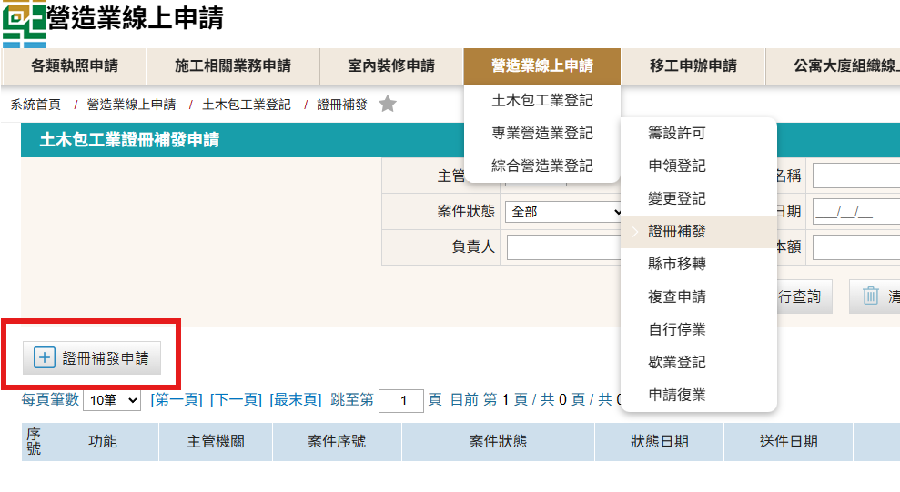
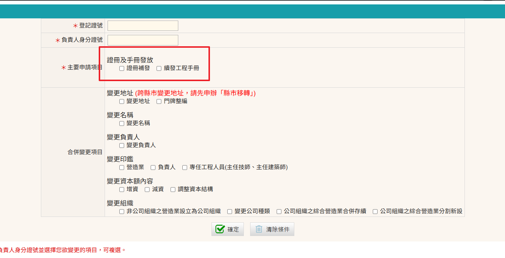
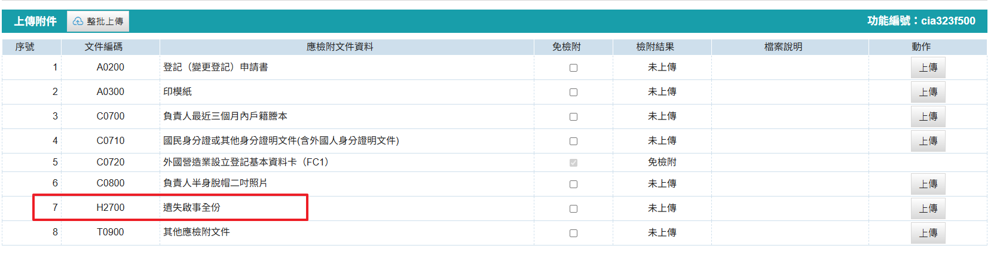
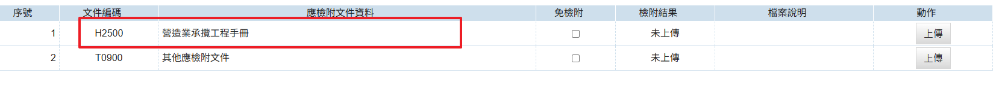

有關於工程承攬手冊或綜合營造業登記證書遺失，需進行登報作廢，始得辦理手冊或證書補發，以免遺失之文件遭人冒用 

### 手冊或證書補發(續發)申請步驟

1. 進入「營造業線上申請」→「綜合營造業登記」→「證冊補發」進行申請
    <figure markdown="span">
    {.img-fluid tag=37}
    <figcaption>依圖片進入申請系統，點選紅框證冊補發申請建立案件</figcaption>
    </figure>

2. 選擇申請之項目 
若營造業證書或手冊遺失需申請重新補發(可同時申請補發)，請選擇「證冊補發」 
    <figure markdown="span">
    {.img-fluid tag=38}
    <figcaption>「證冊補發」需登報掛失，手冊續發則免</figcaption>
    </figure>

3. 證冊補發應檢附之項目
    <figure markdown="span">
    {.img-fluid tag=39}
    <figcaption>需上傳登報之掃描正本</figcaption>
    </figure>

4. 續發工程手冊應檢附之項目
    <figure markdown="span">
    {.img-fluid tag=40}
    <figcaption>續發工程手冊可不上傳承攬手冊掃描(依各縣市機關收件標準檢附)，惟手冊本冊包含所有附冊須於送件後，一並送至登記所屬縣市政府辦理手冊續發</figcaption>
    </figure>

### 手冊或證書補發(續發)申請送件
本申請於送件後，手冊本冊補發需攜帶[印模紙紙本(點選連結下載範本)](https://www.treca.org.tw/treca-journal/2015-07-31-07-57-30.html)(附冊申請補發免附)至所屬縣市政府進行送件，證書補發不須檢附印模紙，續發工程手冊需攜帶手冊本冊包含所有附冊至登記地所屬縣市政府進行送件  
憑證綁定步驟與[許可申請](Contractors_Registration.md)送件流程相同，送件人皆需以自然人憑證進行簽章送件，若送件人為受託人，需額外簽署委託書；請列印出來請委託人用印，受託人用印後掃描上傳至文件列表，方可進行送件。 
 
