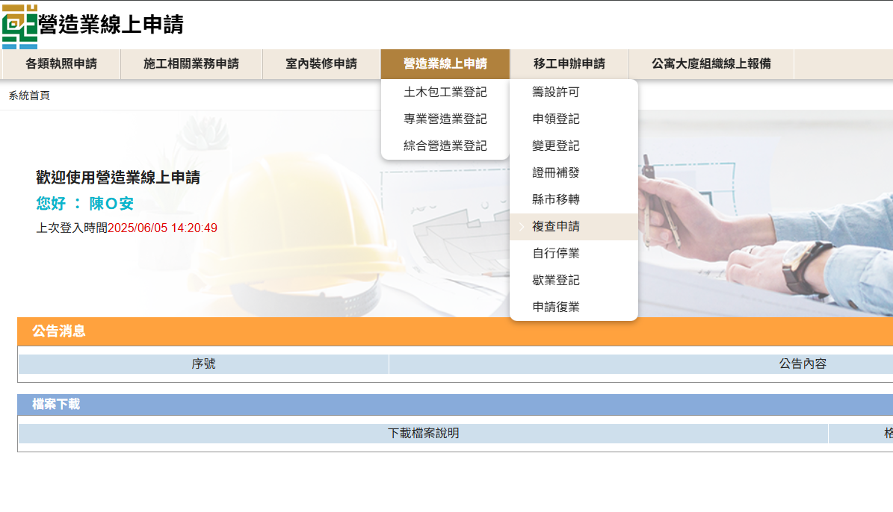
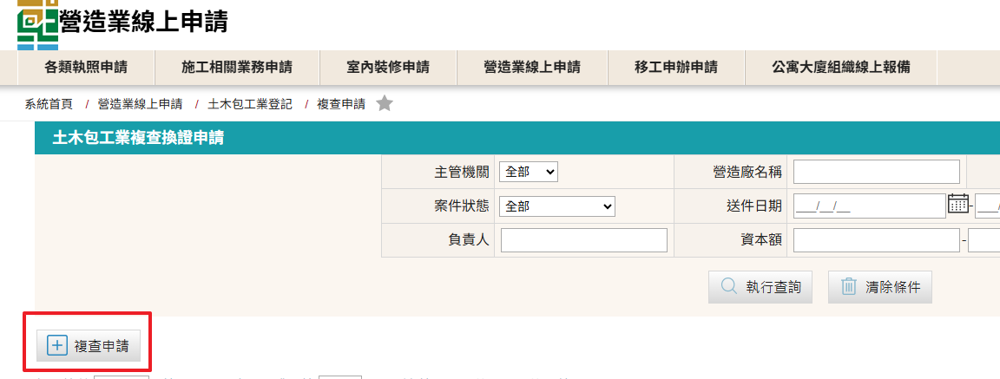
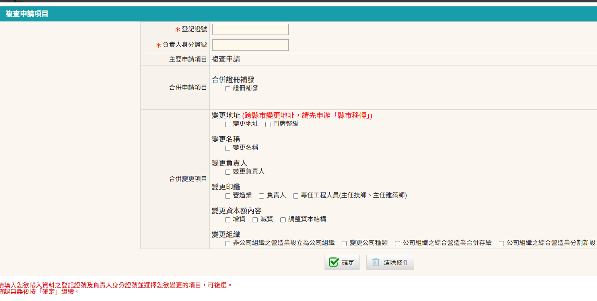
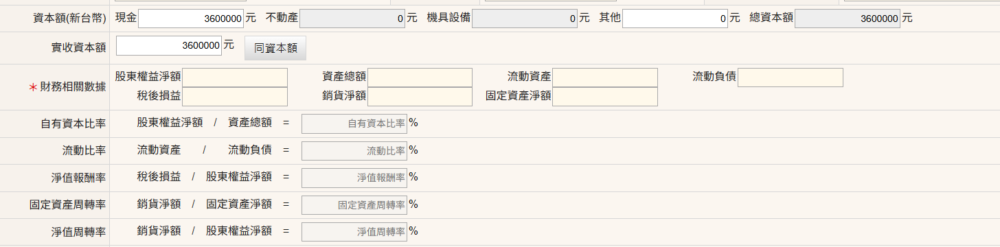
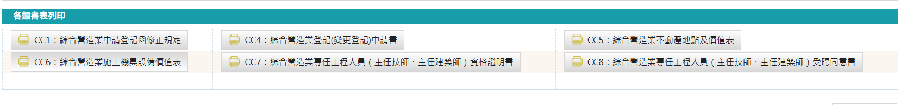
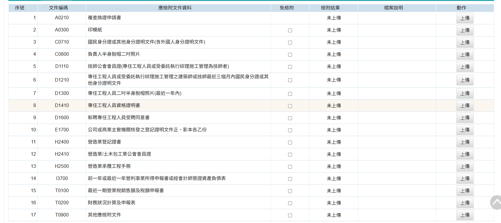

### 複查申請相關規定
營造業法第17條規定： 
&emsp;&emsp;1、營造業自領得營造業登記證書之日起，每滿五年應申請複查，中央主管機關或直轄市、縣（市）主管機關並得隨時抽查之；受抽查者，不得拒絕、妨礙或規避。 
&emsp;&emsp;2、前項複查之申請，應於期限屆滿三個月前六十日內，檢附營造業登記證書及承攬工程手冊或相關證明文件，向中央主管機關或直轄市、縣（市）主管機關提出。 
&emsp;&emsp;3、第一項複查及抽查項目，包括營造業負責人、專任工程人員之相關證明文件、財務狀況、資本額及承攬工程手冊之內容。

### 複查申請申請步驟
1. 進入「營造業線上申請」→「綜合營造業登記」→「複查申請」進行申請
    <figure markdown="span">
    {.img-fluid tag=41}
    <figcaption>依圖片進入申請系統</figcaption>
    </figure>
2. 點選「複查申請」按鈕進行申請
    <figure markdown="span">
    {.img-fluid tag=42}
    <figcaption>點選「複查申請」按鈕進行申請</figcaption>
    </figure>
3. 輸入登記證號[(格式參考)](change_capital.md)及負責人身分證號
    <figure markdown="span">
    {.img-fluid tag=43}
    <figcaption>「複查申請」可併辦其他項目</figcaption>
    </figure>
4. 繕具基本資料後須計算營造業財務情形
 請依前一年或最近一年「營所稅申報之資產負債表」及「最近一期營業稅銷售額及稅額申報書」報表登打數字  
    <figure markdown="span">
    {.img-fluid tag=85}
    <figcaption>填入財務相關數據，系統將自動計算「自有資本比率」、「流動比率」、「淨值報酬率」、「固定資產周轉率」、「淨值周轉率」</figcaption>
    </figure>

5. 使用系統帶出之「綜合營造業複查申請書」及「財務狀況計算及申報表」負責人進行用印及簽名(兩張表於同份檔案內)
    <figure markdown="span">
    {.img-fluid tag=81}
    <figcaption>點選「CC4：綜合營造業登記(變更登記)申請書」列印「綜合營造業複查申請書」及「財務狀況計算及申報表」負責人進行用印及簽名</figcaption>
    </figure>

6. 上傳附件列表
 請將系統帶出之「綜合營造業複查申請書」及「財務狀況計算及申報表」(請參考說明5產出)負責人進行用印及簽名後， ==分開掃描並上傳== ，複查申請書上傳至「A0210	複查換證申請書」欄位，財務狀況計算及申報表上傳至「T0200	財務狀況計算及申報表」欄位  
    <figure markdown="span">
    {.img-fluid tag=82}
    <figcaption>複查文件上傳列表</figcaption>
    </figure>

### 複查申請送件
本申請於送件後，需攜帶貼有負責人兩吋照片、簽名、公司大小印；技師相片簽名印鑑之[印模紙(點選連結下載範本)](https://www.treca.org.tw/treca-journal/2015-07-31-07-57-30.html)，以及原登記證書至登記地所屬縣市政府進行送件。  
憑證綁定步驟與[許可申請](Contractors_Registration.md)送件流程相同，送件人皆需以自然人憑證進行簽章送件，若送件人為受託人，需額外簽署委託書；請列印出來請委託人用印，受託人用印後掃描上傳至文件列表，方可進行送件。 

線上案件送件成功後，須將手冊及證書、印模紙(負責人，技師)送至縣市政府，後續進行手冊註記及證書換發。