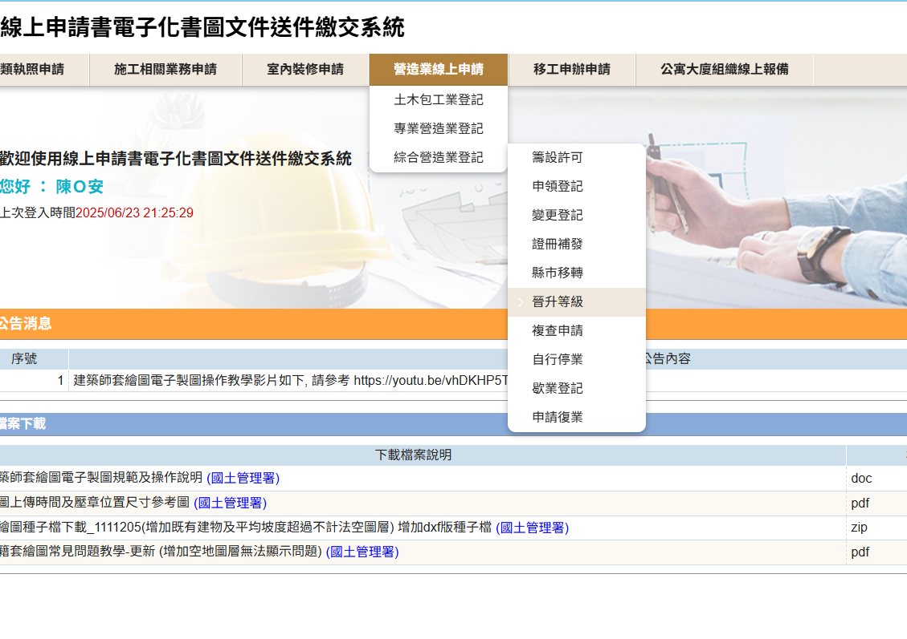
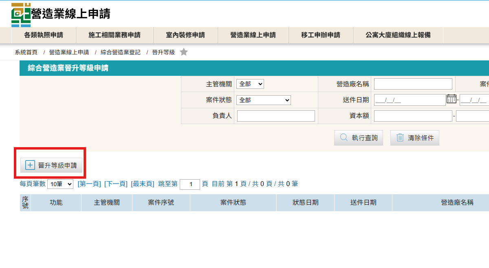
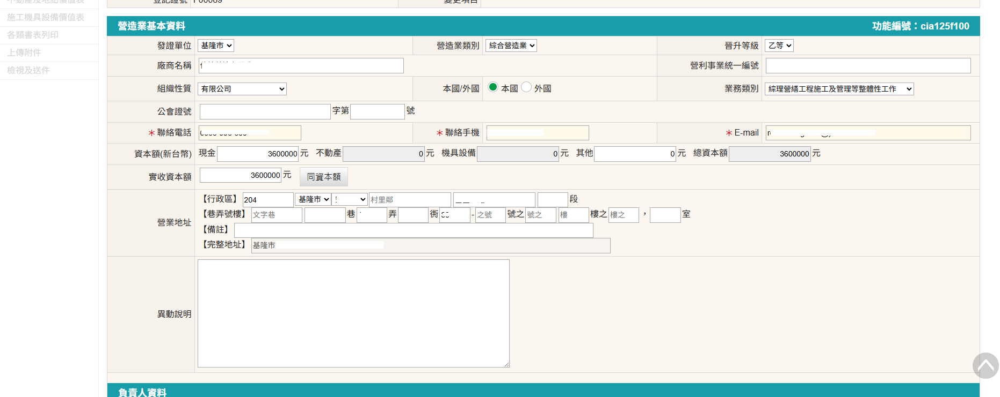

### 晉升等級相關規定

營造業法第7條第5項規定： 
&emsp;&emsp;「乙等綜合營造業必須由丙等綜合營造業有三年業績，五年內其承攬工程竣工累計達新臺幣二億元以上，並經評鑑二年列為第一級者。」 
營造業法第7條第6項規定： 
&emsp;&emsp;「甲等綜合營造業必須由乙等綜合營造業有三年業績，五年內其承攬工程竣工累計達新臺幣三億元以上，並經評鑑三年列為第一級者。」 

### 綜合營造業晉升等級申請步驟
1. 進入「營造業線上申請」→「綜合營造業登記」→「晉升等級」進行申請
    <figure markdown="span">
    {.img-fluid tag=74}
    <figcaption>依圖片進入申請系統</figcaption>
    </figure>
2. 點選「晉升等級申請」進行申請
    <figure markdown="span">
    {.img-fluid tag=75}
    </figure>
3. 進入後進行基本資料登打
    <figure markdown="span">
    {.img-fluid tag=76}
    </figure>

    !!! warning

        1、綜合營造業升等僅能逐級晉升，如：丙→乙、乙→甲（外國營造業除外）。 
        2、資本額須符合該級營造業設立門檻，丙等資本額需大於新台幣360萬元整以上，乙等資本額需大於新台幣1,200萬元整以上，甲等資本額需大於新台幣2,250萬元整以上

4. 資料上傳
    - 綜合營造業登記 (變更登記)申請書，請使用系統產製表格用印，以確保資料正確性。
    - 請依資料上傳列表進行資料檢附上傳，未涉及變更項目，請依各地方主管機關送件標準進行檢附。
    - 「H3000 評鑑結果證明文件」欄位，依營造業法第7條第5、6項規定，丙升乙等需檢附連續兩年評鑑結果為第一級營造業之評鑑證書；乙升甲等需檢附連續三年評鑑結果為第一級營造業之評鑑證書。
    - 「H2600 承攬工程經歷表及各項證明文件」欄位，除須升等至該等級日期後起算至少滿3年工程業績外，並需檢附 升等掛件日前1日起算5年內之經主管機關同意核備註記之工程相關佐證資料，另須彙整明細總表加總5年內經認定工程之「完工金額」，依營造業法第7條第5、6項規定，丙升乙五年內其承攬工程竣工累計達新臺幣二億元以上；乙升甲五年內其承攬工程竣工累計達新臺幣三億元以上，資料彙整後壓縮至一PDF檔內進行上傳。

### 申請送件
憑證綁定步驟與[許可申請](Contractors_Registration.md)送件流程相同，送件人皆需以自然人憑證進行簽章送件，若送件人為受託人，需額外簽署委託書；請列印出來請委託人用印，受託人用印後掃描上傳至文件列表，方可進行送件。 
 
線上案件送件成功後，須將手冊及營造業登記證書送至縣市政府，後續進行營照業登記證書及手冊註記。    