  <meta name="robots" content="noindex" />

### 專業營造業籌設許可相關規定
營造業法第三條第四點相關規定，主管單位為中央主管機關（內政部國土管理署），並由中央主管機關委託各縣市政府代辦登記管理業務。 
專業營造業設立資本額及及其專任工程人員相關規定請參閱[專業營造業之資本額及其專任工程人員資歷人數標準表](https://glrs.moi.gov.tw/LawContent.aspx?id=FL031531) 
專業營造業設立分兩階段，第一階段需先向縣（市）政府進行「籌設許可」申請，進行設立之資格審查，於資格審查通過後，由審查機關發文通知，俟取得核准設立函文至公司主管機關進行營業項目登記，取得公司登記後可再進行第二階段之[「申領登記」](receive_manual.md)申請。

!!! 營造業法第三條第四點規定

    四、專業營造業：係指經向中央主管機關辦理許可、登記，從事專業工程之廠商。

### 籌設許可申請步驟

1. 進入「新建築執照線上申請書電子化書圖文件送件繳交系統」
    <figure markdown="span">
    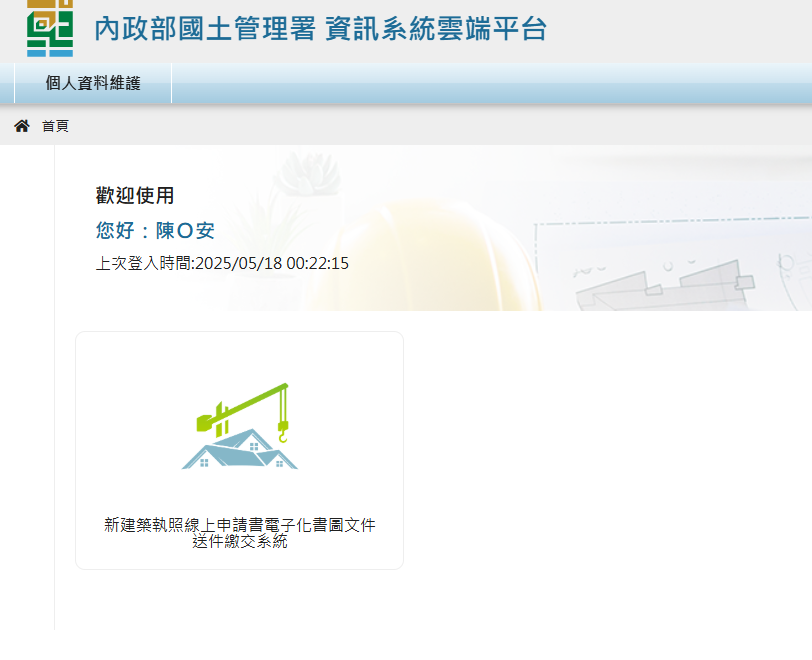{.img-fluid tag=8}
    <figcaption>點選「書圖文件送件繳交系統」</figcaption>
    </figure>

2. 進入「營造業線上申請」→「專業營造業登記」→「籌設許可」進入進行申請
    <figure markdown="span">
    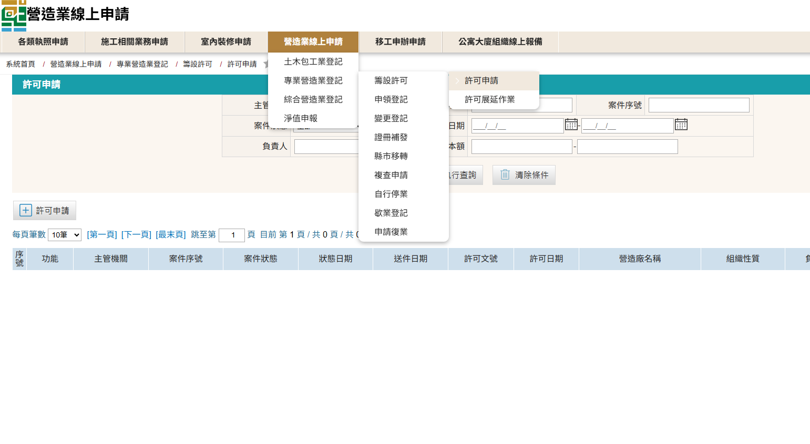{.img-fluid tag=100}
    <figcaption>依圖片進入申請系統</figcaption>
    </figure>

3. 點選「許可申請」按鈕建立案件
    <figure markdown="span">
    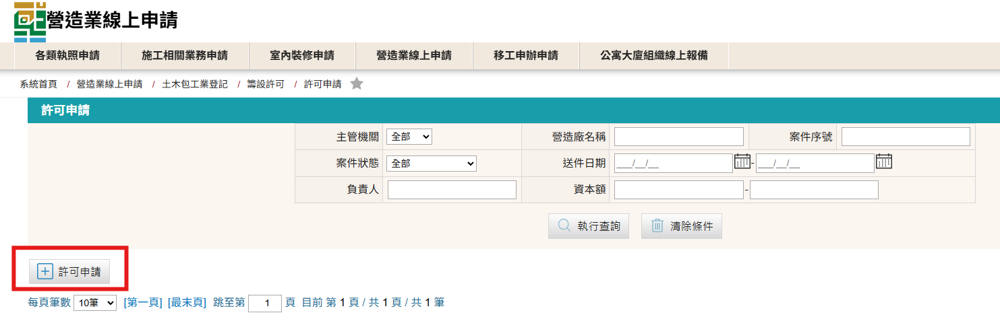{.img-fluid tag=10}
    <figcaption>點選許可申請按鈕建立案件</figcaption>
    </figure>

4. 登打公司基本資料
    <figure markdown="span">
    {.img-fluid tag=101}
    <figcaption>籌設申請表格</figcaption>
    </figure>

    !!! warning

        項目說明：  
        1、「發證單位」請選擇欲登記之縣市。 
        2、「廠商名稱」不可與現有已登記之營造廠名稱重複。 
        3、「專業工程項目」請選擇欲登記項目，選擇登記二項以上專業工程項目者，其資本額以金額較高者為準；其專任工程人員資格應符合各該專業工程項目之規定，但得僅置一人。 
        4、「資本額(新台幣)」依「專業工程項目」之不同種類，應備相應金額之資本額([詳參閱](https://glrs.moi.gov.tw/LawContent.aspx?id=FL031531))

#### 上傳負責人相片，公司大小章及簽名
<figure markdown="span">
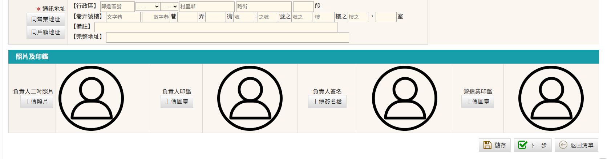{.img-fluid tag=12}
<figcaption>上傳負責人相片，公司大小章及簽名，文件格式僅限JPG檔</figcaption>
</figure>
   
   
!!! warning

    上傳圖負責人相片，公司大小章及簽名注意事項如下： 
    1、上傳檔案 ==格式僅限JPG檔== ，上傳成功會在畫面上顯示上傳內容，若上傳失敗會影像後續表格內容帶入。 
    2、可將負責人相片，印鑑，簽名掃描成電子檔後後使用 `windows鍵` + `shift鍵` + `S鍵` (MAC系統為 `Command鍵` + `shift鍵` + `4鍵`)進行快速畫面擷取，擷取時請去掉多餘畫面白邊，使文件剛剛好為需求大小。

上傳相片範例
    <figure markdown="span">
    {.img-fluid tag=13}
    <figcaption>正確上傳需完整去除相片多於白邊，且不應影響內容</figcaption>
    </figure>

#### 新增專任工程人員基本資料

有關「專業工程項目」應設置指定專科專任人員及人數請參閱[專業營造業之資本額及其專任工程人員資歷人數標準表](https://glrs.moi.gov.tw/LawContent.aspx?id=FL031531)

1. 新增專任工程人員基本資料
    <figure markdown="span">
    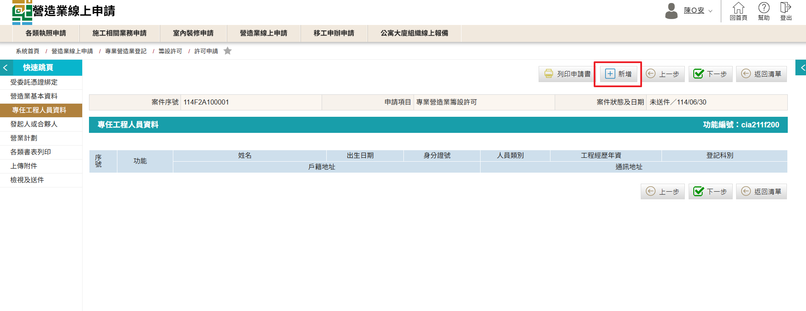{.img-fluid tag=102}
    <figcaption>選擇「專任工程人員資料」頁籤，選擇紅框新增專任工程人員</figcaption>
    </figure>

2. 輸入專任工程人員基本資料

    <figure markdown="span">
    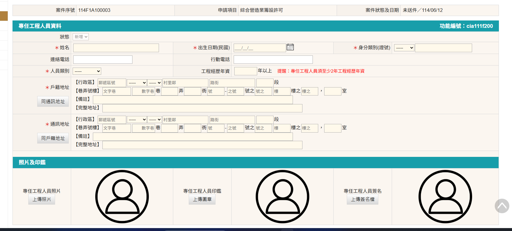{.img-fluid tag=57}
    <figcaption>選擇「專任工程人員資料」頁籤，選擇紅框新增專任工程人員，下方上傳照片，印鑑、簽名欄位格式僅接受上傳JPG檔</figcaption>
    </figure>
    !!! warning

        專業營造業需聘任專任工程人員，其登記科別應符合「專業工程項目」(登記二項以上專業工程項目者，其資本額以金額較高者為準)所要求外，年資需兩年以上，且必須專任專職 

3. 基本資料輸入完成後，至畫面底部新增專任工程登記科別

    <figure markdown="span">
    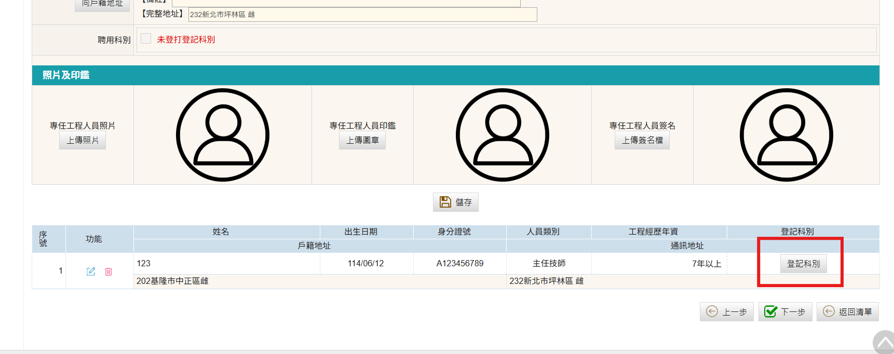{.img-fluid tag=58}
    <figcaption>選擇紅框「登記科別」按鈕，進入登記科別設定</figcaption>
    </figure>

4. 點選右上新增按鈕建立登記科別

    <figure markdown="span">
    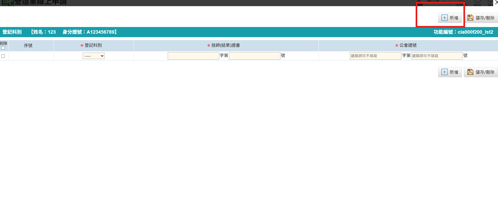{.img-fluid tag=59}
    <figcaption>技師(結業)證書為需輸入技師證書字號，公會證號為輸入加入公會之證件證號</figcaption>
    </figure>

    若登記人員類別為「主任技師」者，需選擇登記科別；若登記人員類別為「主任建築師」者，則不需選擇登記科別，且不須填寫公會證號。

    !!! note

        有關專業營造業其專任工程人員為技師者，營造業法並無相關規定規定專業營造業之專任工程人員為技師者應加入技師公會([詳參閱](https://www.dbaweb.tcg.gov.tw/TempRules/rules/front/Rule_show.aspx?entry=1342))

#### 專業營造業許可申請書列印
以上營造業基本資料、發起人或合夥人資料、營業計劃完成登打後請至各類書表列印頁面，列印出「SC3：專業營造業許可申請書」，表格內容會將前項登打內容自動帶入表格，不須手動登打， ==請務必使用產出表格簽章用印，以免手動登打誤繕導致與系統資料不一致== 。
    <figure markdown="span">
    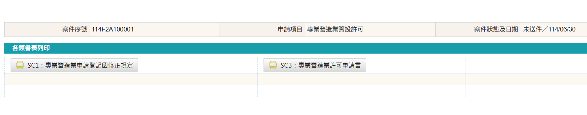{.img-fluid tag=103}
    <figcaption>列印許可申請書簽名用印</figcaption>
    </figure>
表格產製後，須由負責人本人於申請書上用大小印並簽名，以及簽署負責人未擔任其他營造業之負責人、專任工程人員或工地主任切結。
    <figure markdown="span">
    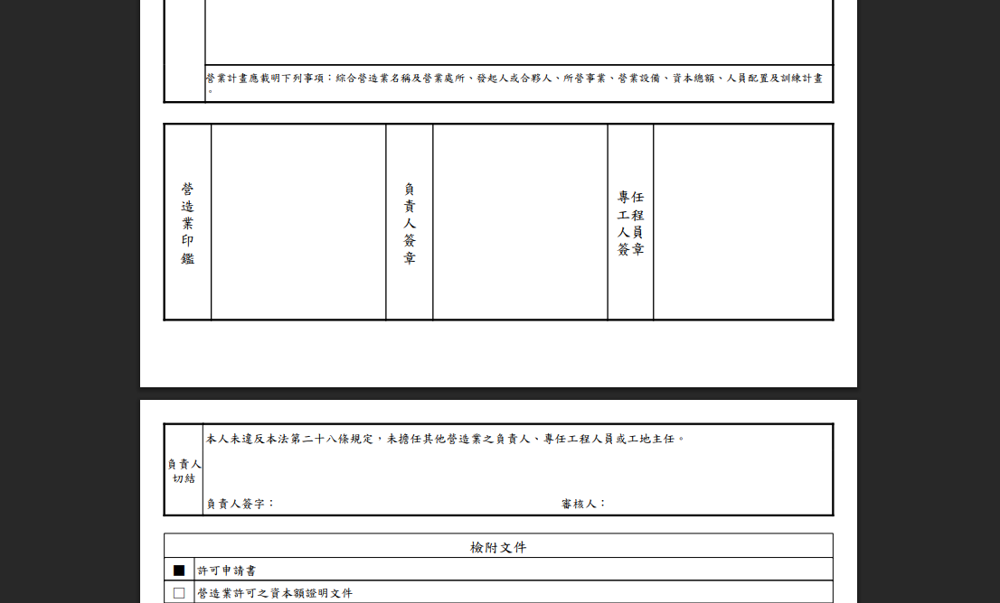{.img-fluid tag=61}
    <figcaption>負責人用公司大小印連同切結並簽名</figcaption>
    </figure>
!!! warning

    有關各縣(市)政府收件規定及標準，需依申請地主管縣(市)政府政府規定為準，部分縣(市)政府要求負責人須到場親簽，部分不用，請逕洽各縣(市)政府承辦人。

#### 專業營造業申請附件上傳
專業營造業許可申請需上傳文件如圖：
    <figure markdown="span">
    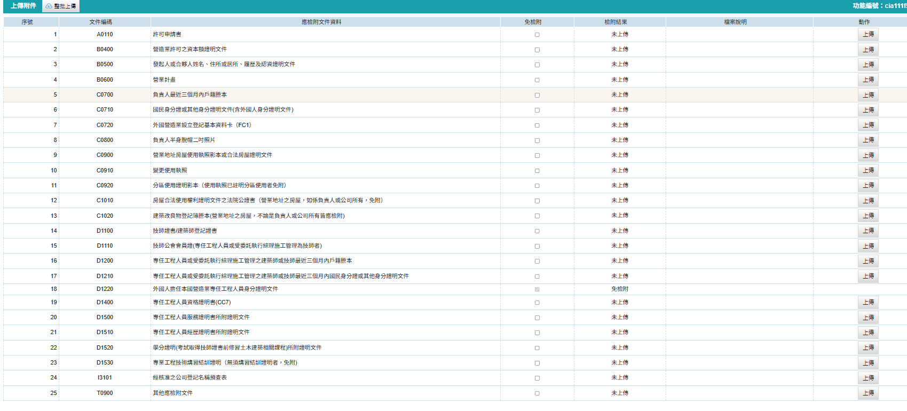{.img-fluid tag=62}
    <figcaption>依列表要求上傳附件(若與公司實際情形不合之文件可勾選「免檢附」)</figcaption>
    </figure>

!!! warning

    文件上傳注意事項： 
    1、文件`D1500 專任工程人員服務證明書`須辦理公證，若服務機關為政府單位則免公證，或其證書背面受機關註記者，可免提供經歷證明書、服務證明書、資格證明書 
    2、文件`C0910 變更使用執照`若登記地址使用執造存根為「辦公室」用途則不需辦理變更，可勾選「免檢附」不須上傳，若非辦公室用途則需洽所屬縣(市)政府使用管理科辦理用途變更。 
    3、`C1010 房屋合法使用權利證明文件之法院公證書`若房屋所有權為負責人所有則不需辦理租約公證，可勾選「免檢附」不須上傳，若所有權人需辦理租約公證。 
    4、`C0720 外國營造業設立登記基本資料卡（FC1）`非本國營造業才須上傳，本國營造業可勾選「免檢附」不須上傳。 
    5、`T0900 其他應檢附文件`視各縣(市)主管機關承辦決定是否上傳其他補充資料。
系統送件時 ==必須== 使用自然人憑證，以下講解憑證綁定步驟。

#### 憑證綁定步驟
綁定憑證時請至畫面右上角，點選帳戶名稱→註冊憑證作業 (如下圖)
    <figure markdown="span">
    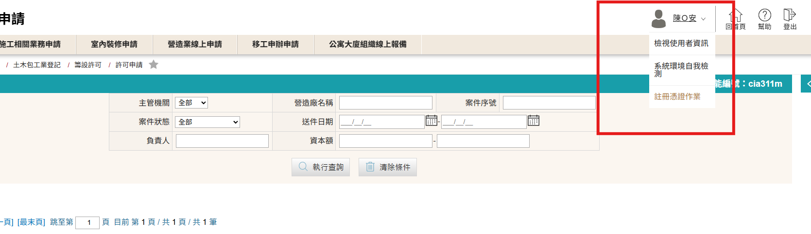{.img-fluid tag=17}
    <figcaption>點選帳戶名稱→註冊憑證作業</figcaption>
    </figure>
點選新增按鈕可加入數張憑證 (帳戶類型為營造廠可輸入工商憑證卡號)，自然人憑證卡號為卡片上條碼下方之英文2位 + 數字14碼之格式，輸入後點擊儲存即可於送件時進行憑證簽章。
    <figure markdown="span">
    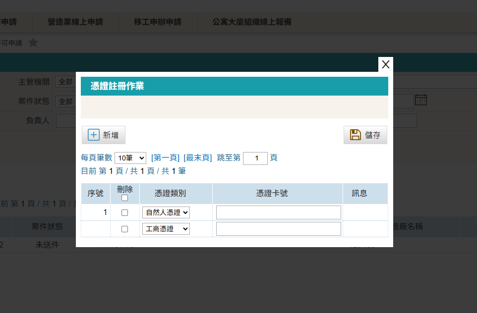{.img-fluid tag=18}
    <figcaption>可新增多張憑證</figcaption>
    </figure>
!!! warning

    綁定之憑證務必和帳號登記人姓名，身分證一致，否則進行憑證簽章時將會無法驗證。

#### 專業營造業許可申請送件
上述文件列表文件皆已上傳 ==（包含不須上傳的部分需勾選免檢附）== ，以及第一部分之資料完成登打，無缺漏事項時，系統方可開放送件。 
案件送出時會執行電子簽章程序，若成功將會顯示送件成功，案件可於縣市管理者未收件時進行自行抽回，若承辦以收件，需請縣市承辦協助退件，進行案件修改(退件不會導致案件內容遺失)。

!!! warning

    若送件人為受託人，則會多額外一步驟，需額外簽署委託書；請列印出來請委託人用印，受託人用印後掃描上傳至文件列表，方可進行送件。