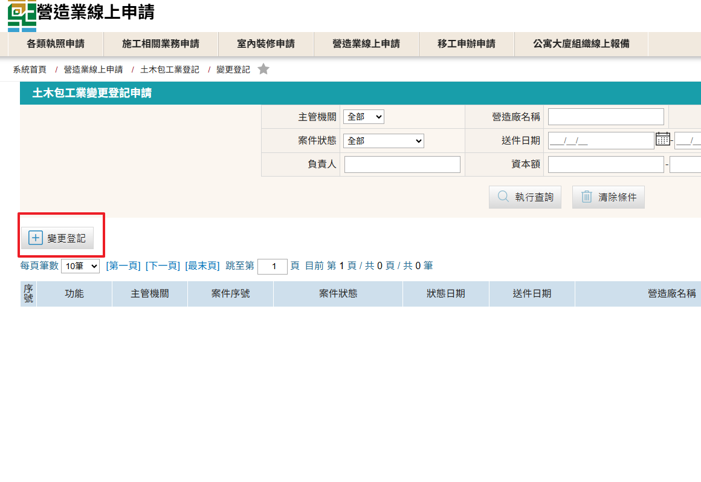
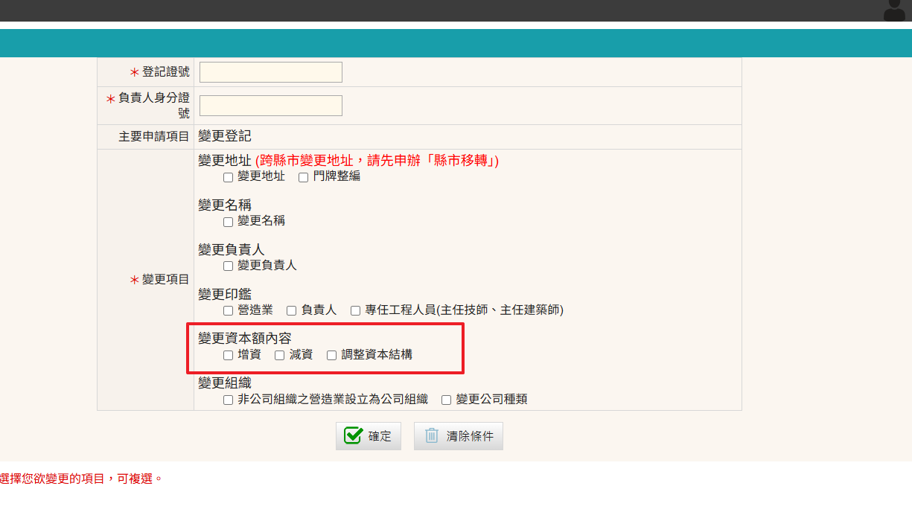
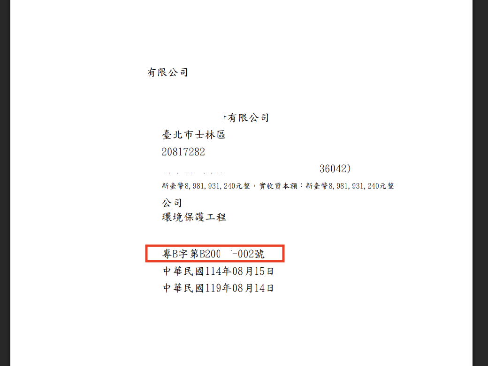
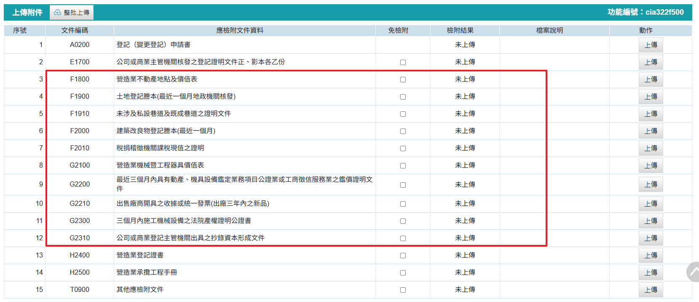

### 專業營造業資本額相關規定
營造業法第九條第一項第二點規定： 
&emsp;&emsp;資本額在一定金額以上；選擇登記二項以上專業工程項目者，其資本額以金額較高者為準。

各工程項目登記資本額門檻，請參閱[專業營造業之資本額及其專任工程人員資歷人數標準表](https://glrs.moi.gov.tw/LawContent.aspx?id=FL031531)
!!! note

    - 無論增資或減資，資本額需大於等於該等級之資本額規定。
    - 若於營造業登記停業期間，經濟部登記事項有變更時，則於營造業復業時併同辦理變更即可。

### 變更資本額申請步驟
1. 進入「營造業線上申請」→「專業營造業登記」→「變更登記」進行申請
    <figure markdown="span">
    {.img-fluid tag=25}
    <figcaption>依圖片進入申請系統</figcaption>
    </figure>

2. 點選「變更登記」按鈕進行申請
    <figure markdown="span">
    {.img-fluid tag=26}
    <figcaption>點選「變更登記」按鈕進行申請</figcaption>
    </figure>

3. 選取須變更之資本額項目選項
    <figure markdown="span">
    {.img-fluid tag=27}
    <figcaption>選取須變更之資本額項目選項</figcaption>
    </figure>

    !!! note 
        變更申請允許多項項目併辦變更，若無列出之變更項目，則代表無法合併辦理。 
        `例：增資可與變更名稱、變更負責人等項目併辦`

4. 登記證號可於登記證書上取得，格式為專X字第X○○○○○號，於此欄位輸入時只需填入英文字 + 五碼數字即可，如B00123。
    <figure markdown="span">
    {.img-fluid tag=115}
    <figcaption>只需輸入英文字 + 五碼數字即可</figcaption>
    </figure>

5. 進入後即可帶入營造廠原登記資料，於營造業基本資料頁面異動資本額資料，負責人照片印鑑簽名上傳方式可參照[許可申請](Contractors_Registration.md)頁面，(格式僅限上傳JPG)檔

6. 上傳附件列表
    <figure markdown="span">
    {.img-fluid tag=29}
    <figcaption>紅框框選之部分，資本額結構非全現金者才須上傳，全現金組成者只需上傳（變更登記）申請書，公司或商業主管機關核發之資本額變更登記證明文件，營造業登記證書掃描</figcaption>
    </figure>

### 變更資本額申請送件
憑證綁定步驟與[許可申請](Contractors_Registration.md)送件流程相同，送件人皆需以自然人憑證進行簽章送件，若送件人為受託人，需額外簽署委託書；請列印出來請委託人用印，受託人用印後掃描上傳至文件列表，方可進行送件。 
 
線上案件送件成功後，須將手冊及證書送至縣市政府，後續進行手冊註記及證書換發。    

### 申請專業營造業資本額變更規費

- 申請專業營造業資本額變更，每案新臺幣兩千四百元整，其中項目包含專業營造業資本額變更規費新臺幣一千兩百整、核發登記證書規費新臺幣一千元整及審查費新臺幣兩百元整。

!!! warning
    - 相關收費標準請參閱[營造業規費收費標準](https://law.moj.gov.tw/LawClass/LawAll.aspx?PCode=D0070170)
    - 若多項業務併辦，則審查費只會收一次。