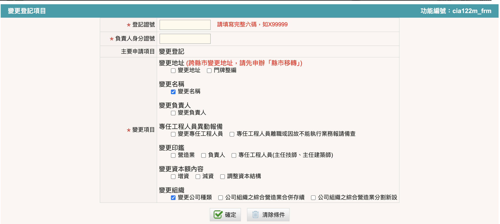
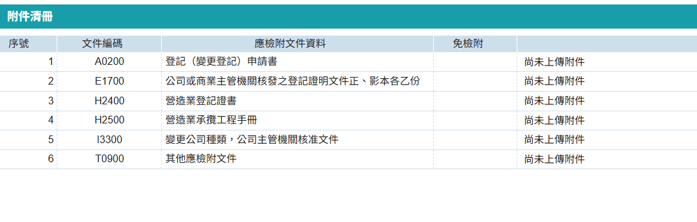

!!! warning

    - 若於營造業登記停業期間，經濟部登記事項有變更時，則於營造業復業時併同辦理變更即可。
    - 若辦理變更公司組織涉及公司名稱變更者不須另案申請變更公司印鑑。
變更組織類型僅指變更公司類型或營業項目分割，或合併其他營造廠，其中不包含由專業營造業變更為土木包工業或綜合營造業，如需變更為其他類型營造業，須辦理原營造廠歇業後，另行辦理設立其他類型營造業籌設許可。 

### 變更公司組織類型申請步驟

1. 進入「營造業線上申請」→「專業營造工業登記」→「變更登記」進行申請
    <figure markdown="span">
    {.img-fluid tag=25}
    <figcaption>依圖片進入申請系統</figcaption>
    </figure>

2. 有關進行「變更組織」時，因組織變更涉及名稱變更，如：「丁丁有限公司」因組織變更，故名稱變更為「丁丁股份有限公司」，請於選擇變更項目時請同時勾選「名稱變更」，才可於案件變更時同步更改公司名稱，又或公司進行合併或分割後涉及名稱變更者也需勾選[名稱變更](change_name.md)選項。
    <figure markdown="span">
    {.img-fluid tag=107}
    <figcaption>「變更組織」需併同勾選其餘需變更相關項目</figcaption>
    </figure>

    !!! note

        - 「變更公司種類」係指從有限公司變更為股份有限公司或反之亦然。
        - 「公司組織之綜合營造業合併存續」係指兩間具有營造業(或土木包工業)登記之營造廠合併，同時可合併該公司之資本額及工程實績，受合併之營造廠則不再存續，須於合併完成後至受合併營造廠所屬登記縣市政府辦理歇業。
        - 「公司組織之綜合營造業分割新設」係指原有營造業將營造業登記項目移轉給既存或新設之公司，受移轉之公司則可取得該公司之營造業登記資格(綜合營造業可延續原營造業等級)，且原營造廠登記證號及承攬手冊將沿用，則原有營造廠則不具備營造業登記資格，依法不可繼續執行法規規定之營繕工程業務。

3. 變更名稱申請上傳項目
    <figure markdown="span">
    {.img-fluid tag=36}
    <figcaption>「變更組織」需上傳資料 (需檢附商業主管機關之變更組織核准函文)</figcaption>
    </figure>

### 變更公司組織類型申請送件
本申請於送件後，需攜帶原登記證書及承攬手冊至登記地所屬縣市政府進行送件(如涉及營造業分割或消滅情事者，須於本次變更業務辦妥後至登記地所屬縣市政府辦理第二間營造廠變更登記相關事宜)。  
憑證綁定步驟與[許可申請](Contractors_Registration.md)送件流程相同，送件人皆需以自然人憑證進行簽章送件，若送件人為受託人，需額外簽署委託書；請列印出來請委託人用印，受託人用印後掃描上傳至文件列表，方可進行送件。 
 
線上案件送件成功後，須將手冊本冊(正本)及原登記證書送至縣市政府，後續進行手冊註記。    

### 申請專業營造業公司組織類型變更規費

- 申請專業營造業公司組織類型變更每案新臺幣四千二百元整，其中項目包含專業營造業組織類型變更規費新臺幣三千元整、換發登記證書規費新臺幣一千元整及審查費新臺幣兩百元整。

!!! warning
    - 相關收費標準請參閱[營造業規費收費標準](https://law.moj.gov.tw/LawClass/LawAll.aspx?PCode=D0070170)
    - 若多項業務併辦，則審查費只會收一次。
    - 因變更組織更正變更公司名稱者（如：小明有限公司變更為小明股份有限公司）不另外收「變更名稱」規費