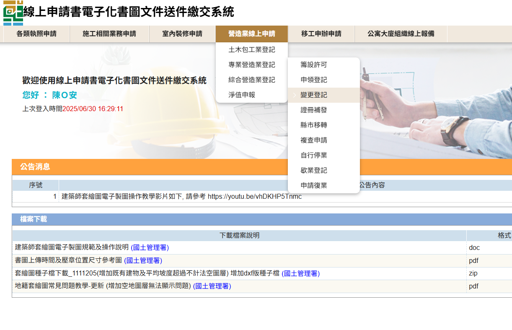
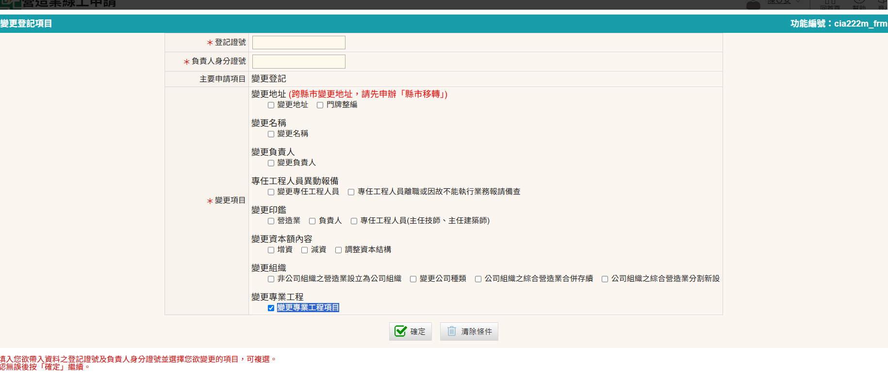
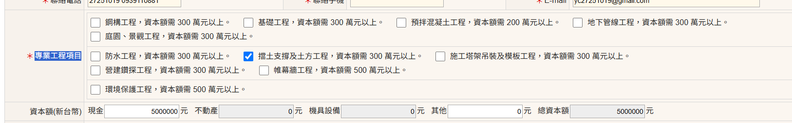

  <meta name="robots" content="noindex" />

### 變更專業工程項目登記規定
專業營造業變更專業工程項目其資本額及專任工程人員應符合相關規定，請參閱[專業營造業之資本額及其專任工程人員資歷人數標準表](https://glrs.moi.gov.tw/LawContent.aspx?id=FL031531) 

### 變更專業工程項目登記申請步驟
1. 進入「營造業線上申請」→「專業營造業登記」→「變更登記」進行申請
    <figure markdown="span">
    {.img-fluid tag=104}
    <figcaption>依圖片進入申請系統</figcaption>
    </figure>

2. 選擇「變更專業工程項目」
    <figure markdown="span">
    {.img-fluid tag=105}
    <figcaption>依圖片進入申請系統</figcaption>
    </figure>

3. 「專業工程項目」登記二項以上專業工程項目者，其資本額以金額較高者為準(資本額需大於其項目規定)；其專任工程人員資格應符合各該專業工程項目之規定，但得僅置一人。
    <figure markdown="span">
    {.img-fluid tag=106}
    <figcaption>勾選需變更之專業工程項目</figcaption>
    </figure>

4. 若專任工程人員資格不符合「專業工程項目」設置標準表者[(詳參)](https://glrs.moi.gov.tw/LawContent.aspx?id=FL031531)，應聘請該資格之專任工程人員至少一名，若登記二項以上專業工程項目者，其專任工程人員資格應符合各該專業工程項目之規定，至少一名。

    - 其專任工程人員變更或聘任申請流程，請參閱[變更專任工程人員(包含技師因故不能執行業務報請備查)](change_engineer.md)一節。