!!! 淨值線上申報系統說明

    本系統為內政部國土管理署114年6月份推動上線，請依各縣市主管機關收件方式決定是否採以線上系統進行淨值線上申報，或採以傳統紙本方式進行申報，又或採以雙軌並行制進行申報；有關淨值線上申報何時採全線上方式進行申報，將視署內安排期程而訂，請申請人多多嘗試並練習。

### 淨值申報目的及相關規定

為確保營造業者依據本國《營造業法》第23條相關規定進行淨值申報，申報內容為前年度6月1日至今年度5月31日止「未完工」工程。旨在檢核營造業未來一年可承攬工程之總額，並保障營繕契約之履約能力。

### 淨值申報注意事項

!!! warning
    - 無論土木包工業，綜合營造業，專業營造業皆須申報
    - 已於五月底前取得使用執照或申請使照登載竣工日期為五月底前之工程，皆屬於已完工工程，故此工程無須申報。
    - 申報項目為已完工但未進行完工註記之工程項目，需檢附[完工切結書](https://www.klcg.gov.tw/wSite/public/Attachment/01803/f1721186277260.odt)。
    - 若未申報淨值得依營造業評鑑辦法之「營造業評鑑認定基準表」認定基準第5點規定︰「未達前4款規定條件或於申請評鑑之日(年度)前2年均未申報淨值者，列為第三級綜合營造業。營造業法4條第2項規定依政府採購法辦理之營繕工程，不得交由評鑑為第三級之綜合營造業或專業營造業承攬。」
    - 若承攬總額超出淨值20倍，得依營造業法第56條：「營造業違反第23條第1項按其情節輕重，予以警告或3個月以上1年以下停業處分。營造業於5年內受警告處分3次者，予以3個月以上1年以下停業處分；於5年內受停業處分期間累計滿3年者，廢止其許可。」

### 淨值申報申請流程
#### 淨值資料輸入
1. 進入「營造業線上申請」→「淨值申報」進行申請
    <figure markdown="span">
    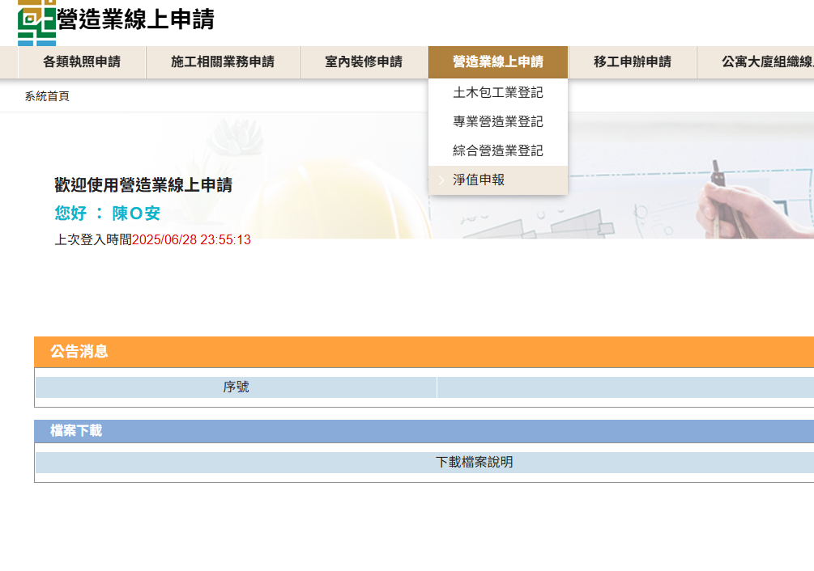{.img-fluid tag=86}
    <figcaption>依圖片進入申請系統</figcaption>
    </figure>
2. 點選「淨值申報」按鈕進行申請，輸入登記證號[(格式參考)](.\General_Construction\change_capital.md)以及負責人身分證(辦理歇業登記操作畫面亦同)
    <figure markdown="span">
    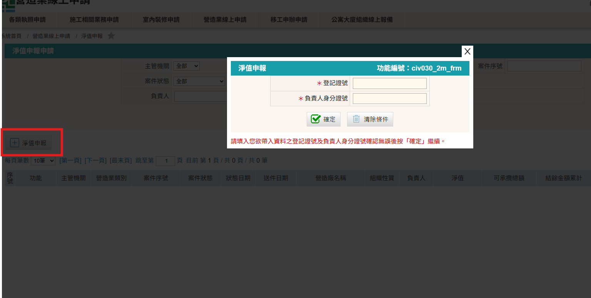{.img-fluid tag=87}
    <figcaption>淨值申報為獨立申報項目，若申請公司同時有其他變更申請案件，亦可進行淨值申報</figcaption>
    </figure>
3. 進入頁面後，欄位說明如下： 
    - 「申報年度」請填寫該年份。
    - 「無工程案件」若勾選擇免填第四步工程資料輸入。
    - 「結餘金額」請填寫該年度未完工工程之 `契約金額(含稅) - 已估驗之發票金額` 。
    - 「淨值」請依該年度「營所稅」所申報之資產負債表之「3000 權益總額」作為淨值認定。
    - 「營造業可承攬總額」由系統依淨值之20倍計算之，「營造業尚可承攬總額」由系統依 `營造業可承攬總額 - 結餘金額` 代表當年度營造業尚可承攬總額。
    <figure markdown="span">
    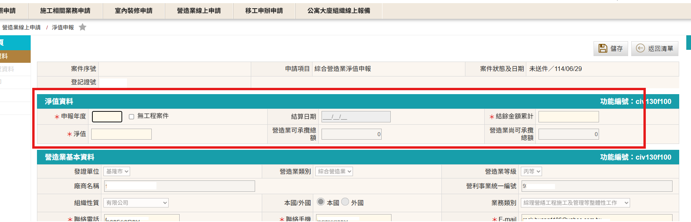{.img-fluid tag=88}
    <figcaption>淨值資料請填寫 ==黃底== 之欄位，灰底部分由系統進行計算</figcaption>
    </figure>
    <figure markdown="span">
    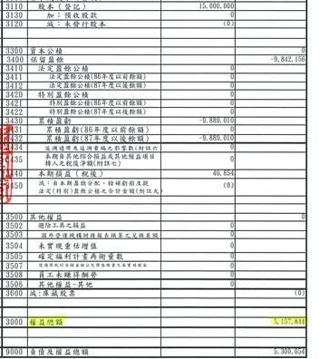{.img-fluid tag=89}
    <figcaption>以「營所稅」資產負債表中「3000 權益總額」作為淨值認定</figcaption>
    </figure>
#### 工程資料輸入

(此步驟為逐案輸入，須將該年度統計區間之所有在建中工程逐筆輸入申報)

!!! warning
    若無工程承攬之廠商，免做此部分工程資料輸入。

<figure markdown="span">
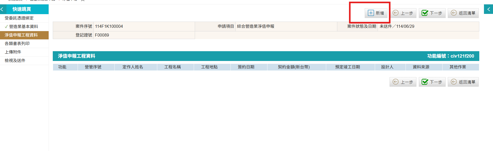{.img-fluid tag=90}
<figcaption>若有工程承攬者，請於此點頁面點選紅框「逐案」新增工程資料</figcaption>
</figure>

<figure markdown="span">
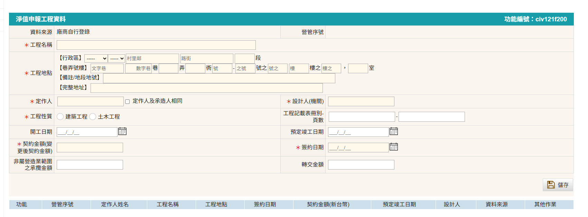{.img-fluid tag=91}
<figcaption>請依照承攬手冊紀載之內容進行登載，登載內容為前年度6月1日至今年度5月31日止「未完工」工程</figcaption>
</figure>
※若有變更契約者(變更設計)，此處應填寫合約變更後價錢

!!! note
    工程地點請至少填至「行政區」，若工程分布於全市者，請點選任意行政區後於備註輸入(全區)。

<figure markdown="span">
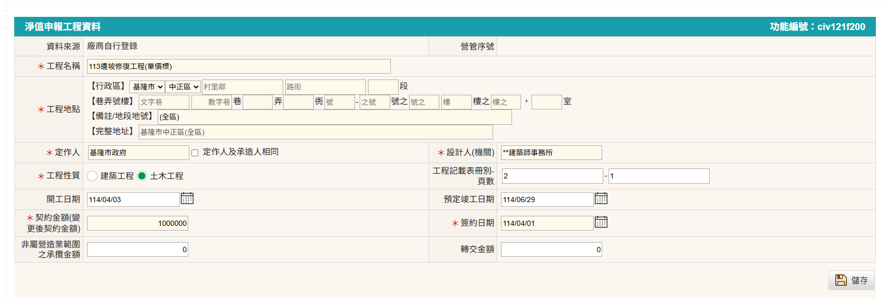{.img-fluid tag=92}
<figcaption>填寫範例</figcaption>
</figure>

儲存紀錄後，該筆資料會變成列入「淨值申報工程資料」資料列表中，並可於此新增「逐次」契約變更紀錄，以及於此「逐張」上傳工程所有以估驗發票。

<figure markdown="span">
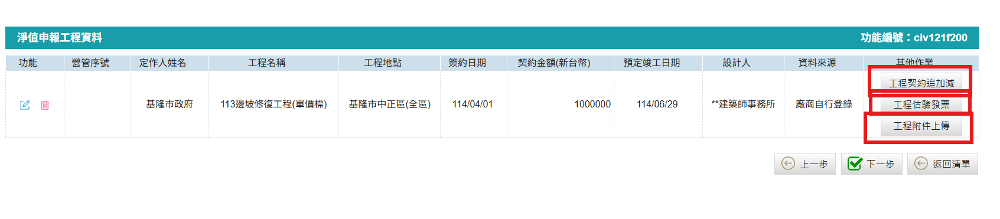{.img-fluid tag=93}
<figcaption>儲存後於此上傳該案佐證資料</figcaption>
</figure>

##### 契約歷次變更金額
<figure markdown="span">
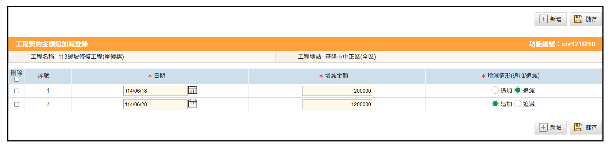{.img-fluid tag=94}
<figcaption>契約歷次變更金額登錄(追加/追減)</figcaption>
</figure>

##### 歷次估驗發票
若已估驗發票多張，請持續重複此流程
<figure markdown="span">
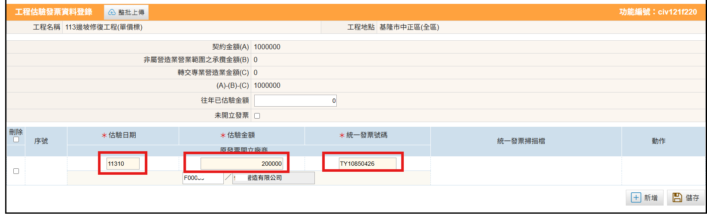{.img-fluid tag=95}
<figcaption>發票資料登錄(若開立發票數張，請按新增加入新發票輸入欄位)</figcaption>
</figure>

!!! note
    發票登錄依序輸入欄位如下：
    
    &emsp;&emsp;- 估驗日期：請填寫申報統計日期範圍內所開立之發票月份 
    &emsp;&emsp;- 估驗金額：發票開立金額 
    &emsp;&emsp;- 統一發票號碼：發票編號含開頭英文字 
    &emsp;&emsp;- 原發票開立廠商：輸入營造廠登記證號(系統自動帶出營造廠名稱) 

發票登打資料後點選儲存，上傳發票掃描檔  
發票掃描檔須符合編碼原則，否則會上傳失敗 
例：檔名開頭為「發票號碼_估驗日期(YYYMM)_」(必要), 文件編碼之後可帶任一說明資訊
Ex. AT24681015_11405_估驗發票.jpg
<figure markdown="span">
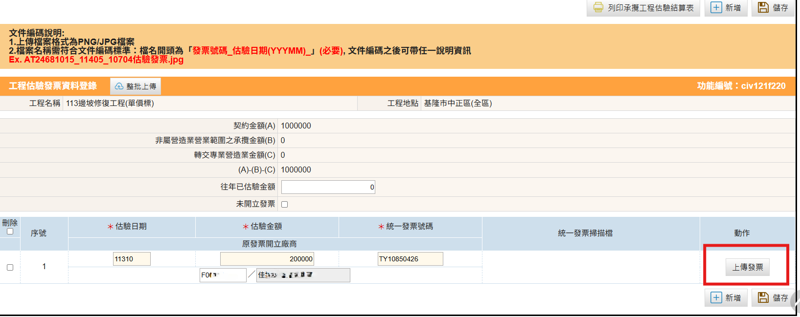{.img-fluid tag=96}
<figcaption>需點選儲存後才可上傳掃描檔</figcaption>
</figure>

##### 工程附件上傳
<figure markdown="span">
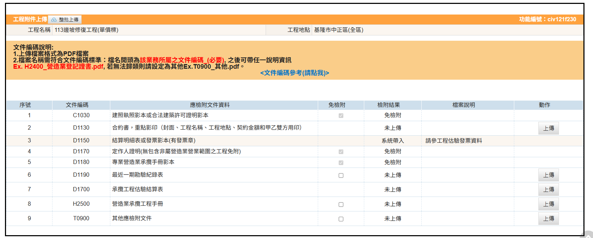{.img-fluid tag=97}
<figcaption>逐案依列表內容上傳列表資料</figcaption>
</figure>
!!! note
    如有合約變更紀錄，須將原合約掃描及變更契約掃描合併至同份PDF檔上傳。
    
### 文件上傳及送件

<figure markdown="span">
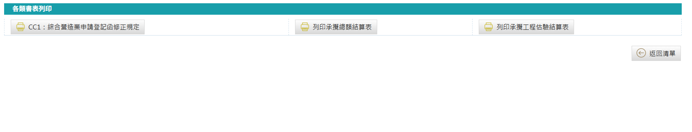{.img-fluid tag=98}
<figcaption>請使用系統所產製之「承攬總額結算表」及「承攬工程估驗結算表」(若無在建中工程案件免附)進行用印簽名及上傳</figcaption>
</figure>

文件上傳列表
<figure markdown="span">
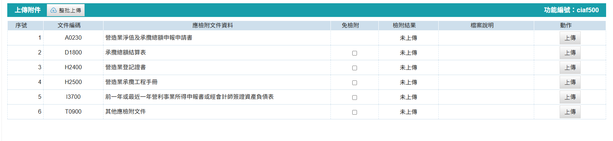{.img-fluid tag=99}
<figcaption>依列表上傳文件</figcaption>
</figure>

### 申請送件
本申請於送件後，需攜帶承攬工程手冊本冊及附冊至登記地所屬縣市政府進行送件。  
憑證綁定步驟與[許可申請](.\General_Construction\Contractors_Registration.md)送件流程相同，送件人皆需以自然人憑證進行簽章送件，若送件人為受託人，需額外簽署委託書；請列印出來請委託人用印，受託人用印後掃描上傳至文件列表，方可進行送件。 

線上案件送件成功後，須將手冊送至縣市政府，後續進行手冊註記。