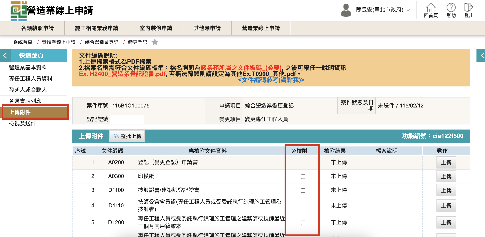
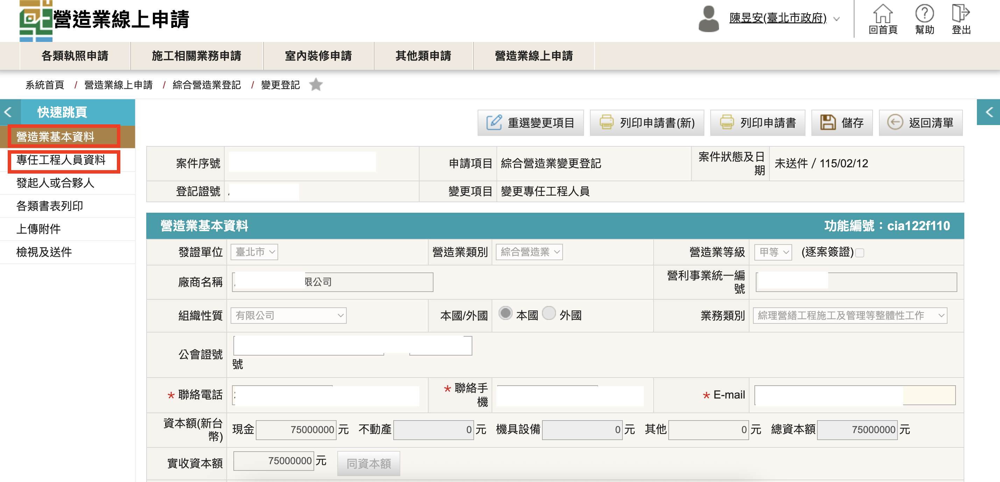
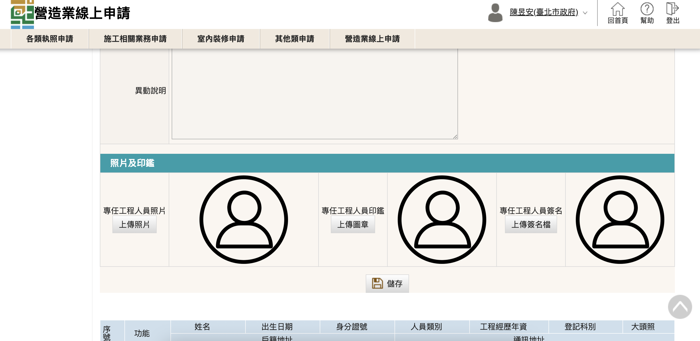
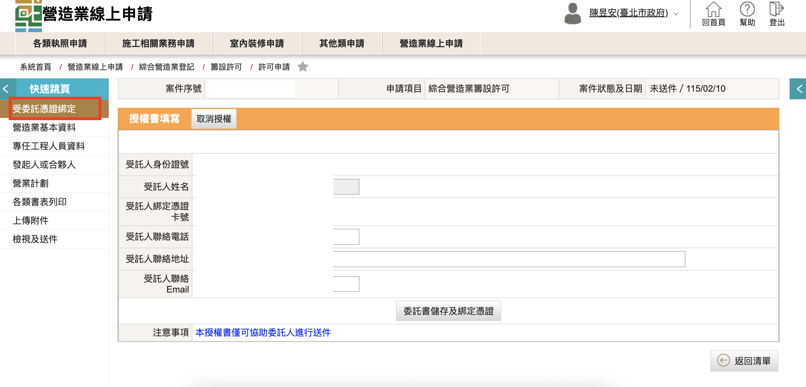
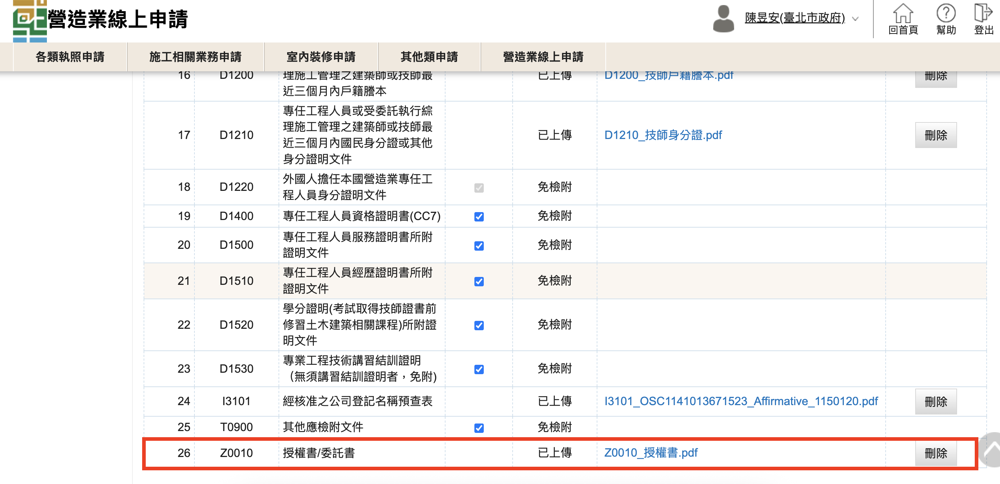
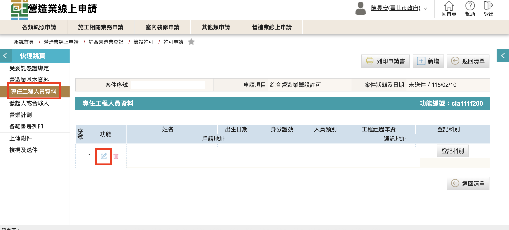
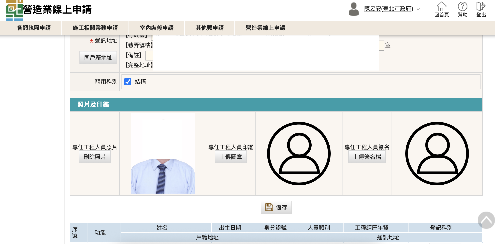

### 為什麼無法送件？
若申請案無法送件可能牽涉多種原因，請依以下建議檢視申請案資料。

1. 點選左側「上傳附件」頁面檢視文件上傳列表是否每項文件均備妥上傳，若不需上傳之文件，請點選免檢附。
    <figure markdown="span">
    {.img-fluid tag=108}
    <figcaption>檢視文件是否上傳，或勾免檢附</figcaption>
    </figure>
2. 檢視營造業基本資料，或是專任工程人員基本資料是否有漏打，或是相片印鑑等圖檔該上傳未上傳。
    <figure markdown="span">
    {.img-fluid tag=109}
    <figcaption>檢視必填資料是否有漏登打</figcaption>
    </figure>
    <figure markdown="span">
    {.img-fluid tag=110}
    <figcaption>技師或負責人資料是否有漏上傳</figcaption>
    </figure>
3. 若送件人非負責人本人或是公司帳戶者，需進行「受委託憑證綁定」（請點選左側列表），進行憑證簽章，憑證綁定時需先行登錄憑證卡號至系統，相關圖文教學流程請參考[憑證卡號登錄](./Civil_Contracting_Industry/Contractors_Registration.md#_6)
    <figure markdown="span">
    {.img-fluid tag=111}
    <figcaption>填妥基本資料點選「委託書儲存及綁定憑證」進行憑證綁定</figcaption>
    </figure>
    產生出之授權書請列印出後蓋授權人印鑑及公司大小印，至「上傳附件」頁面掃描上傳。
    <figure markdown="span">
    {.img-fluid tag=112}
    <figcaption>委託案件必檢附「授權書」文件</figcaption>
    </figure>

### 系統產製的申請書表跑版或沒有技師或大頭照怎麼辦？
申請案件所使用的「登記（變更登記）申請書(CC4)」，或是複查申請使用的「複查換證申請書」以及許可申請使用的「許可申請書」都須上傳技師及負責人大頭貼，且實體兩吋大頭照僅需各備一張，用於黏貼於印模紙即可。

1. 負責人圖片上傳步驟圖文教學流程請參考[上傳負責人相片，公司大小章及簽名](./Civil_Contracting_Industry/Contractors_Registration.md#_3)章節，檔案格式僅限JPG檔，若無法正確顯示縮圖或呈現於系統產製書表內，請重新檢查上傳內容是否符合格式。

2. 技師圖片上傳請至「專任工程人員資料」頁面點選該位技師資料，進入編輯頁面，依序上傳技師之大頭照、印鑑、及簽名，上傳步驟圖文教學流程同樣可參考[上傳負責人相片，公司大小章及簽名](./Civil_Contracting_Industry/Contractors_Registration.md#_3)章節
    <figure markdown="span">
    {.img-fluid tag=113}
    <figcaption>至「專任工程人員資料」點擊編輯鈕進入技師資料並上傳圖片</figcaption>
    </figure>
    <figure markdown="span">
    {.img-fluid tag=114}
    <figcaption>於指定欄位上傳圖片（僅限JPG檔）</figcaption>
    </figure>

### 系統帶出資料與公司現登記資料不符怎麼辦？

如申請人遇到營造業登記資料與公司登記資料不符之情況，首先請先檢查承攬手冊及登記證書原記載資料是否有誤，問題種類分類如下：
    

 - 若營造業原始登記資料有誤，並且與公司登記原始資料不符者，請聯絡營造業主管機關縣市政府協助更正
 - 若營造業原始登記資料有誤，並且公司登記原始同樣有誤者，請於公司主管機關辦理資料更正後，依[營造業開放線上申請項目](index.md#_3)章節之業務辦理範圍，辦理變更（需收規費）
 - 如系統顯示公司類型不符之問題（股份有限公司顯示為有限公司等...），請洽營造業主管機關縣市政府協助統一請系統廠商更正
 - 如負責人戶籍地址、專任工程人員戶籍地址、公司合夥人變更、公司章程變更等，無涉及[營造業法第16條](https://law.moj.gov.tw/LawClass/LawSearchContent.aspx?pcode=D0070110&norge=15,16)需報備項目者，則不需向營造業主管機關縣市政府進行報備

### 竣工註記(業績登記)和逐案簽證能在線上申報嗎?

目前竣工註記和逐案簽證都不能在線上申報，未來內政部國土署將開發營造業數位承攬手冊，該兩項業務採作線上申報日期指日可待，以下提供該兩項業務收費標準。

| 申辦項目      | 收費標準                          |
| :---------: | :----------------------------------: |
|竣工註記(業績登記)|1、工程完工總價未達新台幣2,250萬每案收費新台幣400元整 2、工程完工總價大於新台幣2,250萬且小於新台幣7,500萬，每案收費新台幣600元整 3、工程完工總價大於新台幣7,500萬，每案收費新台幣800元整|
|逐案簽證|每案收費新臺幣1,100元整，其中項目包含逐案簽證規費新臺幣900元整及審查費新臺幣200元整(若申報多案，則只收一次審查費)。

### 以上都沒有我遇到的問題怎麼辦？？？

 - 有關於系統相關問題請洽系統維護廠商「瑪力資訊股份有限公司」客服專線：

  (02)2748-5205

 - 有關於文件準備相關問題，以及案件送件流程等相關問題，請逕洽各營造業主管機關縣市政府。
 - 有關於本網站有相關問題或意見想反應，歡迎來信 陳先生(台北市政府)承辦 指教。

  <strong><a href="mailto:heke0621@gmail.com?subject=營造業線上指南系統相關問題">heke0621@gmail.com</a></strong>

 