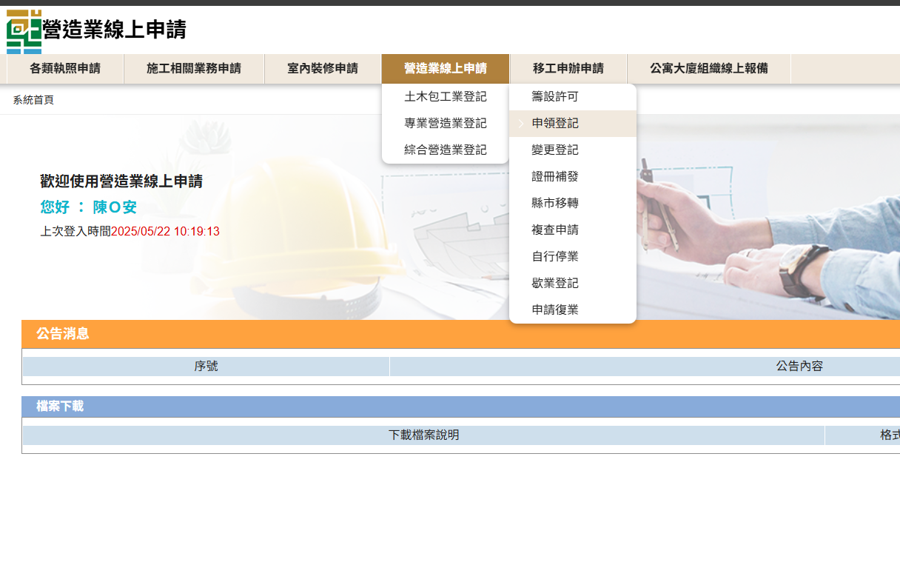
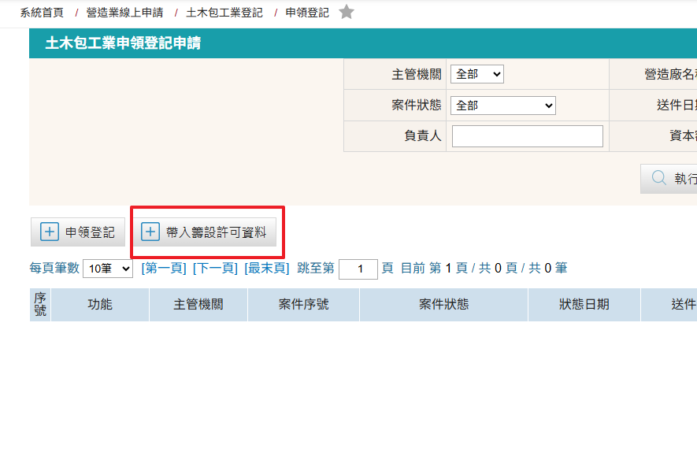
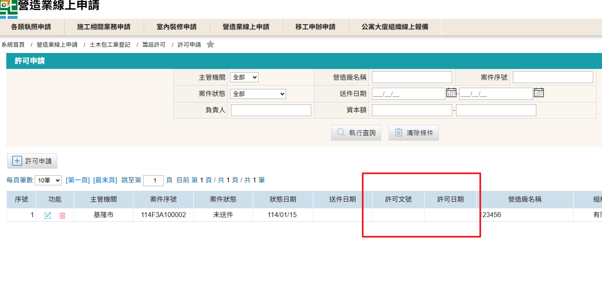
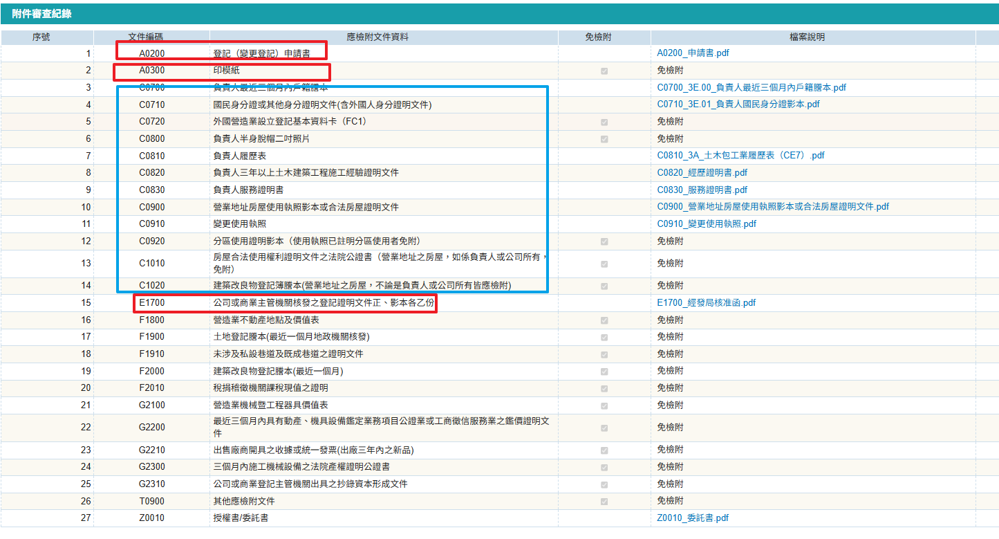

### 申領登記相關規定
營造業法第15條規定： 
&emsp;&emsp;營造業應於辦妥公司或商業登記後六個月內，檢附下列文件，向中央主管機關或直轄市、縣（市）主管機關申請營造業登記、領取營造業登記證書及承攬工程手冊，始得營業；屆期未辦妥者，由中央主管機關或直轄市、縣（市）主管機關廢止其許可

### 申領登記申請步驟

1. 進入「營造業線上申請」→「土木包工業登記」→「申領登記」進行申請
    <figure markdown="span">
    {.img-fluid tag=22}
    <figcaption>依圖片進入申請系統</figcaption>
    </figure>

2. 點選「帶入籌設許可資料」按鈕進行原核准案件帶入
    <figure markdown="span">
    {.img-fluid tag=23}
    <figcaption>點選「帶入籌設許可資料」按鈕進行原核准案件帶入</figcaption>
    </figure>
3. 許可文號須至原[許可申請](Contractors_Registration.md)頁面取得
    <figure markdown="span">
    {.img-fluid tag=20_1}
    <figcaption>原案件核准後可取得許可文號及日期</figcaption>
    </figure>
4. 相關系統操作及文件準備工作可參閱[許可申請](Contractors_Registration.md)章節，本章節不重複贅述
5. 有關文件上傳列表，A0300 印模紙需貼上負責人兩吋照片、用公司大小印、負責人親簽(一橫一直)，於線上案件送件後 ==正本繳送至申請地縣市政府== (部分縣市政府要求親簽，視申請地機關規定辦理)。
6. 文件上傳列表說明： 
1、	登記（變更登記）申請書，需使用系統產製檔案用印簽名 
2、 A0300 印模紙需繳送正本 
3、 籃框為第一階段籌設許可已上傳之文件，第二階段仍需上傳 
4、 E1700 公司或商業主管機關核發之登記證明文件需上傳公司主管機關核准登記之文件掃描，一份即可
    <figure markdown="span">
    {.img-fluid tag=24}
    <figcaption>紅框為需新上傳資料，籃框可使用原核准許可附件上傳</figcaption>
    </figure>

### 申領登記送件
本申請於送件後，需攜帶貼有負責人兩吋照片、簽名、公司大小印之[印模紙(點選連結下載範本)](https://economic.cyhg.gov.tw/News_Content.aspx?n=453&s=158425)至登記地所屬縣市政府進行送件  
憑證綁定步驟與[許可申請](Contractors_Registration.md)送件流程相同，送件人皆需以自然人憑證進行簽章送件，若送件人為受託人，需額外簽署委託書；請列印出來請委託人用印，受託人用印後掃描上傳至文件列表，方可進行送件。 
 
於案件核准後方能取得土木包工業承攬手冊及證書，即可開始遵循營造業法及相關法規規定，合法開始執業。    