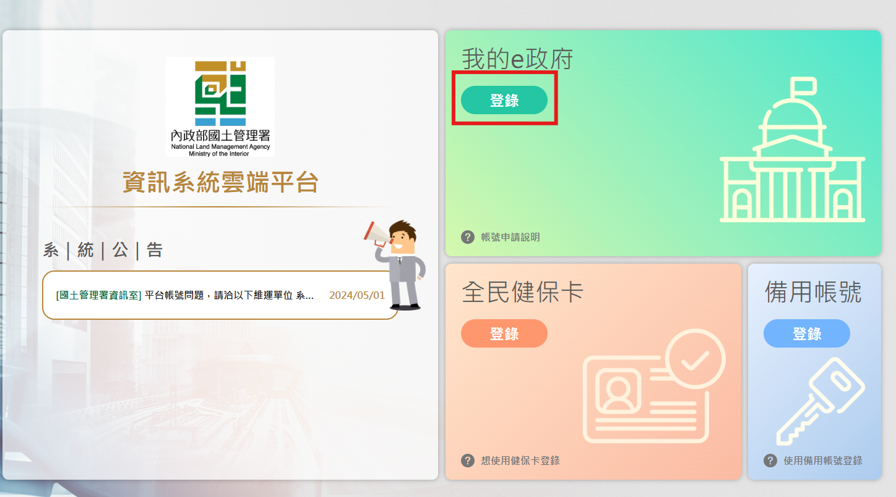
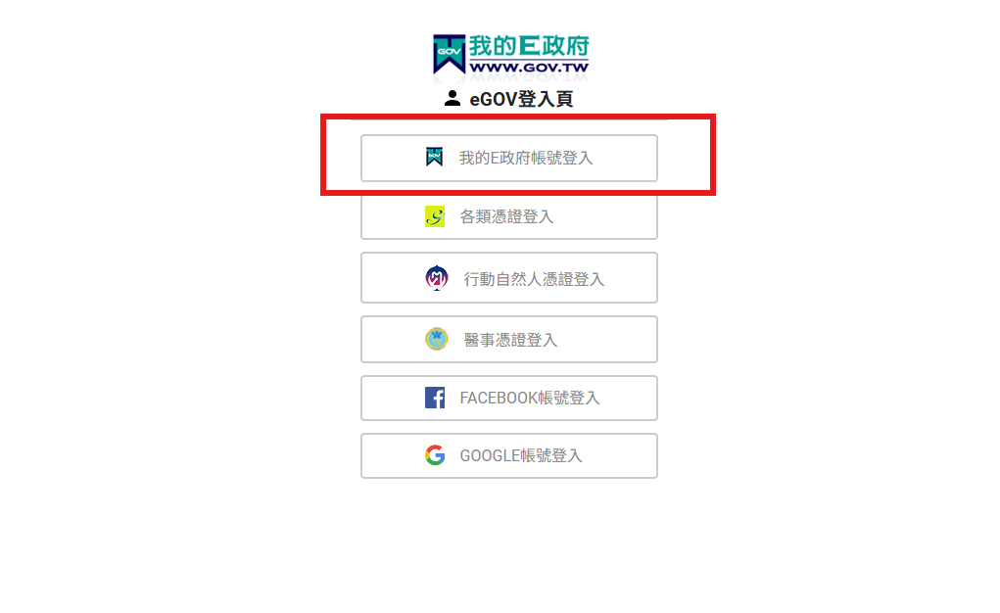
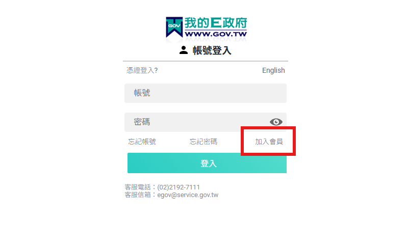
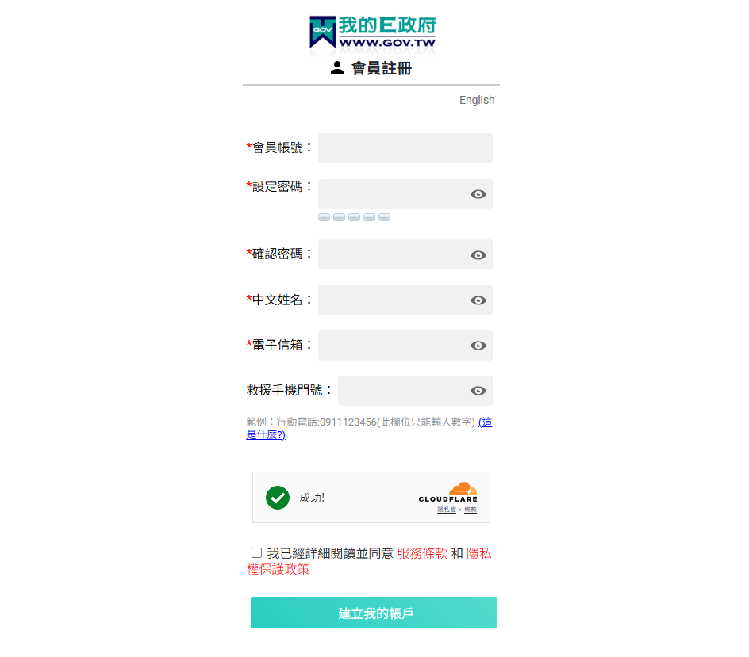
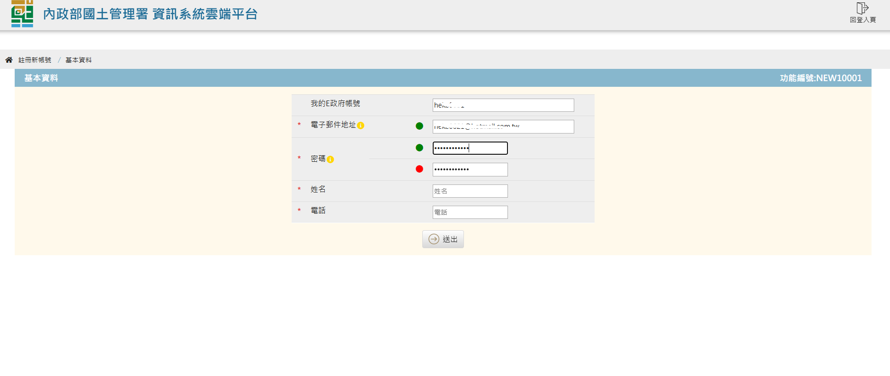
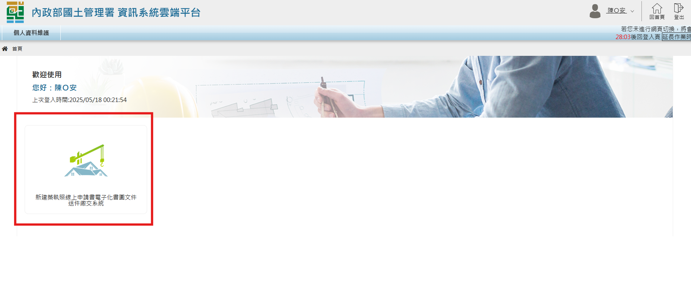
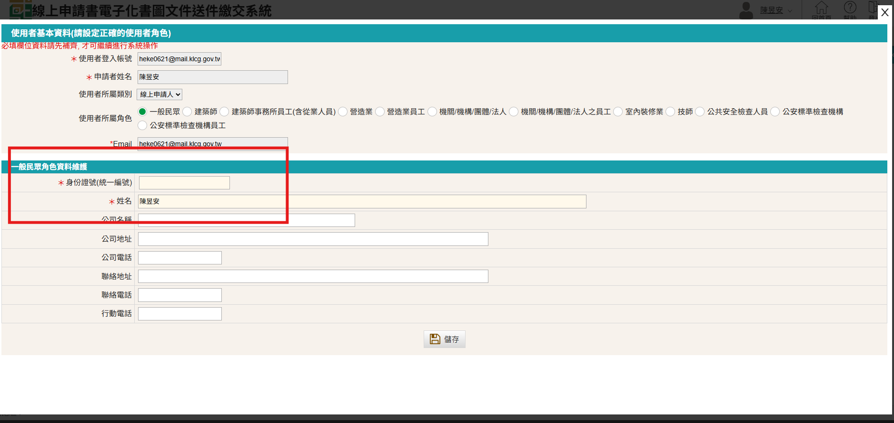
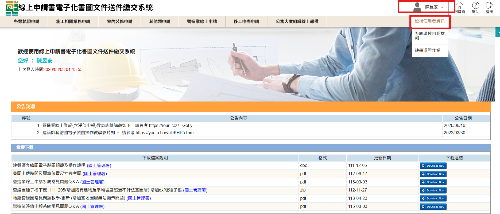
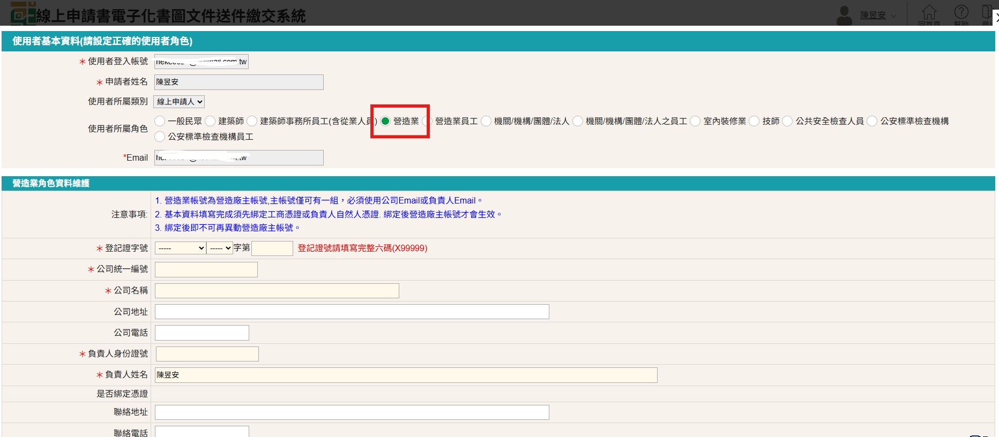

# 如何申請線上系統帳號

### 網站連結

請點連結前往網站進行帳號申請
（連結：[營造業申請系統入口網](https://cloudbm.nlma.gov.tw/CPTL/index.jsp "游標顯示")）

### E政府帳號申請步驟

!!! 備註

    已申請過E政府帳號者可跳過此步驟

1. 點選「新線上申請入口申請專區」
    <figure markdown="span">
    {.img-fluid tag=1}
    <figcaption>點選「新線上申請入口申請專區」</figcaption>
    </figure>

2. 使用「我的e政府」註冊e政府帳號
    <figure markdown="span">
    {.img-fluid tag=2}
    <figcaption>一、點選「登錄」e政府</figcaption>
    </figure>
    <figure markdown="span">
    {.img-fluid tag=3}
    <figcaption>二、點選「我的E政府帳號登入」</figcaption>
    </figure>
    <figure markdown="span">
    {.img-fluid tag=4}
    <figcaption>三、無申請過「E政府」請點選加入會員申請E政府帳號</figcaption>
    </figure>
    <figure markdown="span">
    {.img-fluid tag=5}
    <figcaption>四、資料輸入完後請至登記電子信箱地址完成驗證帳號後即完成帳號註冊流程</figcaption>
    </figure>
    <figure markdown="span">
    {.img-fluid tag=5-1}
    <figcaption>五、設定完備援帳號後，至備援帳號登記的電子信箱收取確認信</figcaption>
    </figure>
!!! warning

    帳號申請之中文姓名請使用本名註冊，避免後續發生自然人憑證綁定問題

### 系統帳號初次設定步驟

#### 成功進入系統後會看到以下畫面
<figure markdown="span">
{.img-fluid tag=6}
<figcaption>一、點選「新建築執照線上申請書電子化書圖文件送件繳交系統」進入線上申請系統</figcaption>
</figure>

#### 使用角色設定(僅第一次進入申請系統需填)
<figure markdown="span">
{.img-fluid tag=7}
<figcaption>二、選取使用者角色及填寫基本資料</figcaption>
</figure>

#### 如何異動申請人角色？
- 請先完成系統帳號初次設定中的使用角色設定後才能異動角色。
<figure markdown="span">
{.img-fluid tag=6-1}
<figcaption>一、點選「新建築執照線上申請書電子化書圖文件送件繳交系統」進入線上申請系統</figcaption>
</figure>
<figure markdown="span">
{.img-fluid tag=6-2}
<figcaption>二、滑鼠移至畫面右上角「使用者名稱」上展開清單，選取「檢視使用者資訊」</figcaption>
</figure>
<figure markdown="span">
{.img-fluid tag=6-3}
<figcaption>三、切換使用者所屬角色為「營造業」，並完成所有欄位資料登打</figcaption>
</figure>

- 使用者若為營造廠之代辦人，角色請選取 ==「一般民眾」==
- 使用者若為營造廠負責人，或營造廠所委託創立營造廠之帳號者，角色請選取 ==「營造業」== (後續可使用負責人之自然人憑證或營造廠工商憑證進行送件)
- 使用者若為營造廠之員工，角色請選取 ==「營造業員工」== ，並使用已存在之 ==「營造業」== 之帳號，替該員工進行授權及綁定後，即可使用「營造業員工」之帳號替營造廠進行送件。

!!! warning

    - 營造業帳號為營造廠主帳號,主帳號僅可有一組，必須使用公司Email或負責人Email。
    - 基本資料填寫完成須先綁定工商憑證或負責人自然人憑證. 綁定後營造廠主帳號才會生效。
    - 綁定後即不可再異動營造廠主帳號。
    - 角色異動時，原角色項下的申請案會全部看不到(除非切換回原本的角色)，若要切換角色後建立新案件，請先將原有角色項下的案件刪除後再切換角色。
    - 角色資料維護(紅框部分)，請身分證字號及姓名部分務必輸入的與該帳號送件時所使用之自然人憑證登記一致，否則後續會發生自然人憑證資料不一致，會無法進行送件。